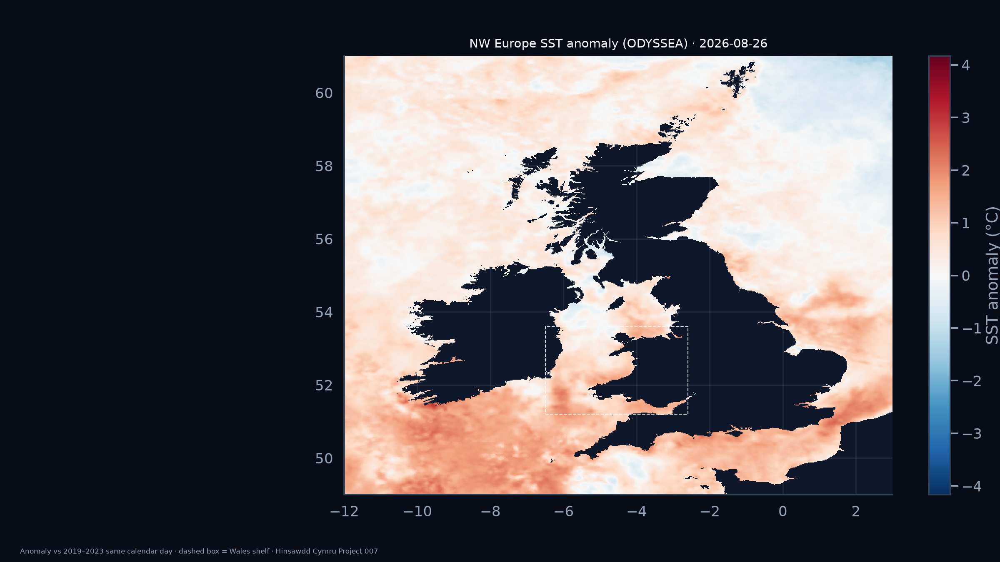

# Hinsawdd Cymru

**Data agored, dadansoddiad tryloyw, ffeithiau am hinsawdd Cymru.**

Open and reproducible analysis of public weather, climate and climate-related environmental data for Wales.

Hinsawdd Cymru is a public-facing research repository. Each numbered project asks a specific question, retains source and derived data, documents assumptions, and produces outputs that can be checked independently. New graphics follow the dark-mode-first system documented in [VISUAL_STYLE.md](VISUAL_STYLE.md).

## Project registry

| ID | Project | Status | Main result |
|---|---|---|---|
| [001](projects/001-rolling-temperature/) | Wales rolling 12-month temperature (monthly) | **Published** | Latest window **Sep 2025–Aug 2026**: **10.65°C**, **3rd** warmest of 1,701 monthly-start windows. |
| [002](projects/002-temperature-pathways/) | Wales temperature pathways | Stage A statistical baseline | Transparent statistical comparison baseline; not a physical climate forecast. |
| [003](projects/003-wales-rainfall/) | Wales rainfall and dryness since 1836 | Published historical analysis | July 2026 was exceptionally dry; the complete August 2025–July 2026 period was slightly wetter than the 1991–2020 reference. |
| [004](projects/004-wales-water-consumption/) | Wales water consumption and data-centre demand | Research baseline v0.1 | Transparent comparison of public water supply and modelled data-centre demand. |
| [005](projects/005-wales-air-quality/) | Wales air quality | Stage A observational baseline | Reference-grade PM2.5 baseline from Welsh AURN monitoring stations. |
| [006](projects/006-wildfire-watch/) | Wales Wildfire Watch | **Published, provisional research output** | Reproducible NASA FIRMS VIIRS thermal-anomaly mapping, official Wales boundary, historical GIF playback and external corroboration. |
| [007](projects/007-wales-coastal-sst/) | Wales coastal sea-surface temperature | **Stage B published** | NW Europe ODYSSEA snapshot maps + Wales-shelf daily series; HadISST monthly baseline; NOAA ONI as Pacific context only. |
| [009](projects/009-solar-climate-attribution/) | Solar variability and modern warming | **Stage A evidence review, provisional** | Source and claim audit, competing hypotheses and reproducible research protocol; numerical attribution pending. |

## Project 007 — Wales coastal SST

Project 007 publishes Copernicus Marine **ODYSSEA** daily sea-surface temperature for the **British Isles and surrounding waters**, with a **Wales shelf headline** time series (bbox lon −6.5…−2.6, lat 51.2…53.6). Regional snapshot maps cover lon −12…3°, lat 49…61°. Anomalies use a **2019–2023** day-of-year baseline. Stage A **HadISST1** monthly remains the long climate record. ENSO is not treated as a Wales causal driver.

Latest ODYSSEA day (**2026-08-26**): Wales shelf SST **17.47 °C**, anomaly **+0.92 °C**; trailing 30-day mean anomaly **+1.39 °C**.

**What you are looking at:** the regional maps show latest-day ocean temperature and anomaly over Ireland, GB and shelf seas (dashed box = Wales headline area). [Figure guide](projects/007-wales-coastal-sst/FIGURES.md) · [HTML snapshot](projects/007-wales-coastal-sst/published/snapshot/index.html)

<a href="projects/007-wales-coastal-sst/">Project 007</a> · <a href="projects/007-wales-coastal-sst/FIGURES.md">Figures</a> · <a href="projects/007-wales-coastal-sst/METHODOLOGY.md">Methodology</a>

## Project 006 — Wales Wildfire Watch

Project 006 uses public NASA FIRMS near-real-time VIIRS observations from Suomi NPP, NOAA-20 and NOAA-21 and the official Welsh Government DataMapWales Communities (Wales) boundary.

The map is generated programmatically with **Python, pandas, Matplotlib and Seaborn**. It is a code-generated scientific graphic, not a generative-image output.

### Latest published map

The current published two-day run (snapshot **21 August 2026 16:34 UTC**, latest obs **13:12 UTC**) contains **19 VIIRS detections in the Wales watch window** and **4 derived candidate clusters inside the official Wales boundary**. These are thermal anomalies, **not a confirmed wildfire count**. The top-ranked cluster this refresh is **Glascwm** (plausible, multi-satellite). Swansea/Gower 24h watch is quiet (**0** detections).

### Heat-anomaly history animation

Day-by-day playback of Wales-watch VIIRS thermal anomalies from **15 June 2026** onward (4 fps). Not confirmed wildfires.

<a href="projects/006-wildfire-watch/published/figures/wales_heat_anomalies_history_dark.html">HTML preview</a> · <a href="projects/006-wildfire-watch/">Project 006</a>

Project 006 maintains a cumulative historical record under `data/history/`. A daily GitHub Actions workflow refreshes the latest data, rebuilds the maps, adds OpenStreetMap and Google Maps links, runs external corroboration and commits changed outputs back to `main`. Local operator tools (`firms_ping`, pass calendar, waiting room) help separate satellite geometry from FIRMS NRT lag.

The project keeps these evidence layers separate:

**satellite observation → derived cluster → satellite-evidence category → independent external corroboration**

[Current situation (21 Aug 2026)](projects/006-wildfire-watch/CURRENT_SITUATION.md) · [Full Project 006 report, caveats and methodology](projects/006-wildfire-watch/)

## Reproducibility

The repository uses a lightweight Reproducible Analytical Pipeline: source provenance, machine-readable derived outputs, documented assumptions and GitHub Actions validation.

## Sources and licensing

Projects use public datasets from organisations including the Met Office, Welsh Government, NRW, DEFRA UK-AIR, NASA FIRMS and NOAA. Source data remain subject to their original licences and copyright. Repository analysis code is released under the [MIT License](LICENSE).

## Independence

This is an independent project and is not an official Met Office, Welsh Government, Senedd Cymru, Natural Resources Wales, NASA, DEFRA, UK Government or Welsh fire and rescue service product. Derived results should be described as independent calculations from cited public evidence, not as figures published or endorsed by those organisations.
