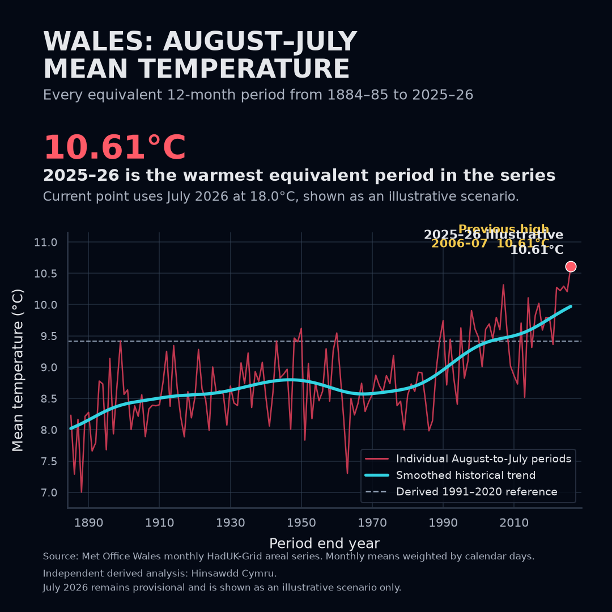
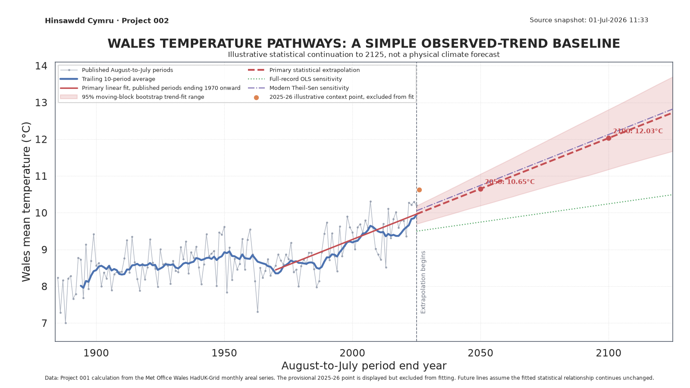

# Hinsawdd Cymru

**Data agored, dadansoddiad tryloyw, ffeithiau am hinsawdd Cymru.**

Open and reproducible analysis of public weather and climate data for Wales.

Hinsawdd Cymru is a small, public-facing research repository. Each numbered project asks a specific question, retains its source and derived data, documents every assumption, and produces a result that can be checked independently.

The repository distinguishes between:

- values published by an authoritative source;
- calculations derived in this repository;
- provisional scenarios that have not yet been published officially.

Each project README is intended to work as a self-contained public results report. Detailed methodology, validation records, source snapshots and machine-readable outputs remain inside the same project folder.

## Project registry

| ID | Project | Status | Main result |
|---|---|---|---|
| [001](projects/001-rolling-temperature/) | Wales August-to-July mean temperature | Provisional, independently revalidated | The 12 months ending July 2026 are robustly the warmest equivalent August-to-July period under every scenario tested. The project README contains the full report and historical trend graphic. |
| [002](projects/002-temperature-pathways/) | Wales temperature pathways | Stage A statistical baseline | A transparent modern-period linear regression is published as an illustrative comparison baseline, with backtesting, uncertainty and sensitivity lines. It is explicitly not a physical climate forecast. |

<!-- BEGIN PROJECT 001 CHART PREVIEWS -->
## Project 001 visual summary

The standard line chart reproduces the conventional historical-series view with complete August-to-July periods. The square dark-mode version presents the same validated data for compact viewing.

<a href="projects/001-rolling-temperature/figures/wales_august_to_july_mean_temperature_line_chart.png"></a>

<p align="center"><a href="projects/001-rolling-temperature/figures/wales_august_to_july_mean_temperature_line_chart_square_dark.png"></a></p>

The final 2025–26 point remains provisional because July 2026 is represented by a clearly labelled illustrative scenario until the official Met Office Wales monthly value is published. [Read the full Project 001 report](projects/001-rolling-temperature/).
<!-- END PROJECT 001 CHART PREVIEWS -->

## Project 002 visual summary

Project 002 asks what a deliberately simple continuation of the observed Wales trend would imply. The result is a statistical baseline for comparison with future UKCP or UKCI ensemble work, not a physical climate forecast.

<a href="projects/002-temperature-pathways/figures/wales_temperature_pathways_linear_regression.png"></a>

The primary fit uses only published-input August-to-July periods ending from 1970 onward. The provisional 2025–26 point is displayed but excluded from training. [Read the Project 002 report](projects/002-temperature-pathways/).

## Repository structure

```text
hinsawdd-cymru/
├── README.md
├── pyproject.toml
└── projects/
    ├── 001-rolling-temperature/
    │   ├── README.md
    │   ├── METHODOLOGY.md
    │   ├── VALIDATION.md
    │   ├── analysis.py
    │   ├── verify.py
    │   ├── data/
    │   ├── figures/
    │   └── tests/
    └── 002-temperature-pathways/
        ├── README.md
        ├── PLAN.md
        ├── OFFICIAL_EVIDENCE_AUDIT.md
        ├── model.py
        ├── verify.py
        ├── data/
        ├── figures/
        └── tests/
```

Each project is self-contained, while the Python environment is shared at repository level.

## Reproduce the projects

```bash
python -m venv .venv
source .venv/bin/activate
pip install -e ".[dev]"
python projects/001-rolling-temperature/analysis.py
python projects/001-rolling-temperature/line_chart_variants.py --update-readmes
pytest
python projects/002-temperature-pathways/model.py
python projects/002-temperature-pathways/verify.py
```

## Quality approach

The repository uses a lightweight Reproducible Analytical Pipeline:

- immutable or checksum-pinned source boundaries;
- automatic reconciliation against official published values where available;
- separate standard-library verification implementations;
- generated machine-readable outputs and public documentation;
- explicit separation of published inputs, provisional scenarios and modelled outputs;
- GitHub Actions validation on every scientific change.

## Sources and licensing

Project 001 uses the Met Office HadUK-Grid Wales areal mean-temperature series, made available under the Open Government Licence. Project 002 consumes the independently verified Project 001 output and adds an illustrative statistical model. The source data remain subject to their original licence and Crown copyright.

The analysis code is released under the [MIT License](LICENSE).

## Independence

This is an independent project and is not an official Met Office, Welsh Government or UK Government product. Derived results should be described as independent calculations from official data, not as figures published or endorsed by those organisations.
