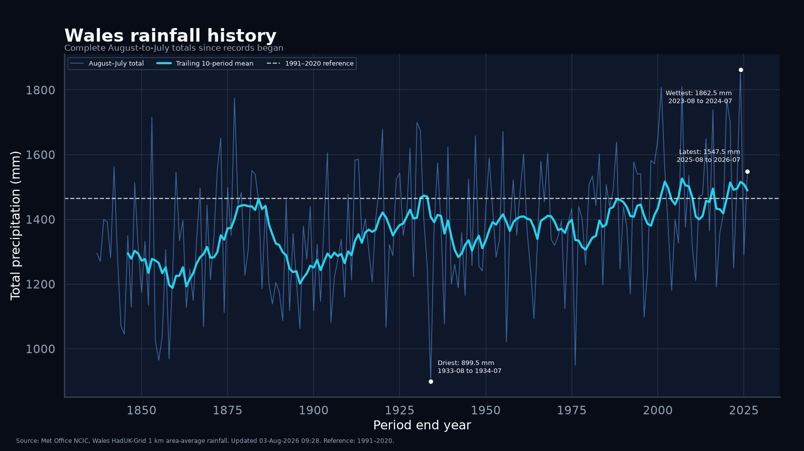
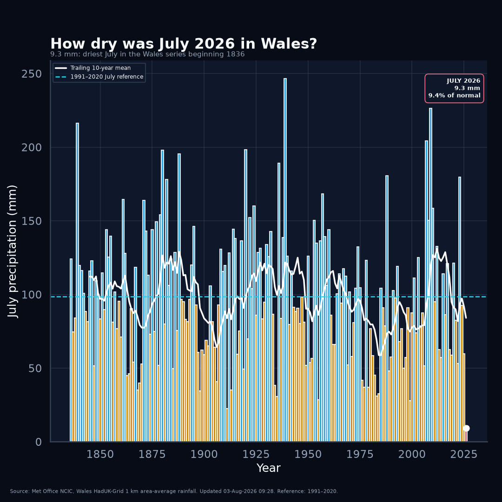

# Hinsawdd Cymru

**Data agored, dadansoddiad tryloyw, ffeithiau am hinsawdd Cymru.**

Open and reproducible analysis of public weather, climate and climate-related resource data for Wales.

Hinsawdd Cymru is a small, public-facing research repository. Each numbered project asks a specific question, retains its source and derived data, documents every assumption, and produces a result that can be checked independently.

The repository distinguishes between:

- values published by an authoritative source;
- calculations derived in this repository;
- provisional scenarios that have not yet been published officially;
- statistical extrapolations that are not physical climate forecasts;
- modelled resource-demand scenarios that are not measured observations.

Each project README is intended to work as a self-contained public results report. Detailed methodology, validation records, source snapshots and machine-readable outputs remain inside the same project folder. New public graphics follow the dark-mode-first system documented in [VISUAL_STYLE.md](VISUAL_STYLE.md).

## Project registry

| ID | Project | Status | Main result |
|---|---|---|---|
| [001](projects/001-rolling-temperature/) | Wales August-to-July mean temperature | Provisional, independently revalidated | The 12 months ending July 2026 are robustly the warmest equivalent August-to-July period under every scenario tested. The project README contains the full report and historical trend graphic. |
| [002](projects/002-temperature-pathways/) | Wales temperature pathways | Stage A statistical baseline | A transparent modern-period linear regression is published as an illustrative comparison baseline, with backtesting, uncertainty and sensitivity lines. It is explicitly not a physical climate forecast. |
| [003](projects/003-wales-rainfall/) | Wales rainfall and dryness since 1836 | Published historical analysis and statistical baseline | July 2026 was exceptionally dry, but the complete August 2025–July 2026 period was slightly wetter than the 1991–2020 reference. Rainfall totals and rain-day counts are kept distinct from formal drought indices. |
| [004](projects/004-wales-water-consumption/) | Wales water consumption and data-centre demand | Research baseline v0.1 | Wales received about 920 Ml/day from its two main public suppliers in 2024–25. Current Welsh colocation data-centre direct water use is modelled at about 0.2–2.7 Ml/day, with a central scenario of 0.7 Ml/day (about 0.08% of that public-supply baseline). This is an estimate, not a measured national total. |
| [005](projects/005-wales-air-quality/) | Wales air quality | Stage A observational baseline | Builds a reference-grade PM2.5 baseline from Welsh AURN monitoring stations, with rolling-year and recent-period views. The first stage measures before attempting wildfire or other source attribution. |

<!-- BEGIN PROJECT 001 CHART PREVIEWS -->
## Project 001 visual summary

The standard line chart reproduces the conventional historical-series view with complete August-to-July periods. The square dark-mode version presents the same validated data for compact viewing.

<a href="projects/001-rolling-temperature/figures/wales_august_to_july_mean_temperature_line_chart.png"></a>

<p align="center"><a href="projects/001-rolling-temperature/figures/wales_august_to_july_mean_temperature_line_chart_square_dark.png"></a></p>

The final 2025–26 point remains provisional because July 2026 is represented by a clearly labelled illustrative scenario until the official Met Office Wales monthly value is published. [Read the full Project 001 report](projects/001-rolling-temperature/).
<!-- END PROJECT 001 CHART PREVIEWS -->

## Project 002 visual summary

Project 002 asks what a deliberately simple continuation of the observed Wales temperature trend would imply. The result is a statistical baseline for comparison with future UKCP or UKCI ensemble work, not a physical climate forecast.

<a href="projects/002-temperature-pathways/figures/wales_temperature_pathways_linear_regression.png"></a>

The primary fit uses only published-input August-to-July periods ending from 1970 onward. The provisional 2025–26 point is displayed but excluded from training. [Read the Project 002 report](projects/002-temperature-pathways/).

## Project 003 visual summary

Project 003 uses the official Met Office Wales rainfall and rain-days-at-least-1-mm series. It compares complete August-to-July periods, individual Julys and rain-day counts without treating any one measure as a formal drought declaration.

**The time window changes the result.** July 2026 recorded **9.3 mm**, only **9.4% of the 1991–2020 July average**, making it the driest of 191 Julys in the series. The complete August 2025–July 2026 period recorded **1,547.5 mm**, or **105.6% of its 1991–2020 reference**, so the full twelve-month period was slightly wetter than normal.

<a href="projects/003-wales-rainfall/figures/wales_august_to_july_rainfall_history_dark.png"></a>

<p align="center"><a href="projects/003-wales-rainfall/figures/wales_july_rainfall_history_dark_square.png"></a></p>

The statistical continuation remains an illustrative comparison baseline, not an official Met Office, UKCP or year-to-year physical forecast. Relative humidity is being developed separately from the official HadUK-Grid `hurs` source. [Read the full Project 003 report](projects/003-wales-rainfall/).

## Project 004 summary

Project 004 asks where public water goes in Wales and how large direct operational water use by data centres is likely to be in comparison with the national public-supply system.

Welsh Government reports approximately **920 Ml/day** supplied in 2024–25 by Dŵr Cymru Welsh Water and Hafren Dyfrdwy. The best currently retained household/non-household split is a historical Dŵr Cymru regulatory estimate of roughly **76% household / 24% non-household customer consumption**; it is labelled historical because the years and supplier coverage have not yet been fully reconciled to the 2024–25 national total.

For data centres, Project 004 uses the UK Government estimate of **154 MW operational Welsh colocation IT capacity** rather than multiplying a directory count of buildings. A low/central/high direct-WUE sensitivity gives approximately **0.18, 0.72 and 2.66 Ml/day**, or **0.02%, 0.08% and 0.29%** of the current 920 Ml/day public-supply comparison baseline.

Those are **modelled scenarios, not measured Welsh data-centre totals**. The project separately records the evidence that local water-network constraints can matter even when the Wales-wide percentage is small, and it keeps planned capacity separate from current operations. [Read the full Project 004 report](projects/004-wales-water-consumption/).

## Project 005 summary

Project 005 starts with direct ground observations of air pollution rather than an air-quality app or an atmospheric model. Stage A uses the Welsh Automatic Urban and Rural Network (AURN) sites currently measuring hourly PM2.5 and retains each station's environment type rather than manufacturing an unweighted national average.

The first analysis produces a rolling 365-day view, a recent 70-day view, station distributions and a monitoring-site map in the repository's dark publication style. Recent values are treated as potentially provisional. Wildfire, traffic, industrial and meteorological attribution is explicitly deferred until the measured record itself shows a pattern worth investigating. [Read the Project 005 baseline](projects/005-wales-air-quality/).

## Repository structure

```text
hinsawdd-cymru/
├── README.md
├── VISUAL_STYLE.md
├── pyproject.toml
└── projects/
    ├── 001-rolling-temperature/
    │   ├── README.md
    │   ├── METHODOLOGY.md
    │   ├── VALIDATION.md
    │   ├── analysis.py
    │   ├── verify.py
    │   ├── data/
    │   ├── figures/
    │   └── tests/
    ├── 002-temperature-pathways/
    │   ├── README.md
    │   ├── PLAN.md
    │   ├── OFFICIAL_EVIDENCE_AUDIT.md
    │   ├── model.py
    │   ├── verify.py
    │   ├── data/
    │   ├── figures/
    │   └── tests/
    ├── 003-wales-rainfall/
    │   ├── README.md
    │   ├── METHODOLOGY.md
    │   ├── HUMIDITY_SOURCE_PLAN.md
    │   ├── fetch_source.py
    │   ├── fetch_raindays_source.py
    │   ├── dark_climate_charts.py
    │   ├── verify_dark.py
    │   ├── data/
    │   ├── figures/
    │   └── tests/
    ├── 004-wales-water-consumption/
    │   ├── README.md
    │   ├── METHODOLOGY.md
    │   ├── SOURCES.md
    │   ├── analysis.py
    │   └── data/
    │       ├── data-centre-evidence-register.csv
    │       └── scenarios.csv
    └── 005-wales-air-quality/
        ├── README.md
        ├── METHODOLOGY.md
        ├── SOURCES.md
        ├── analysis.py
        ├── charts.py
        ├── data/
        ├── figures/
        └── tests/
```

Each project is self-contained, while the Python environment is shared at repository level.

## Reproduce the projects

```bash
python -m venv .venv
source .venv/bin/activate
pip install -e ".[dev]"
python projects/001-rolling-temperature/analysis.py
python projects/001-rolling-temperature/line_chart_variants.py --update-readmes
pytest
python projects/002-temperature-pathways/model.py
python projects/002-temperature-pathways/verify.py
python projects/003-wales-rainfall/fetch_source.py --output-dir projects/003-wales-rainfall/data/raw
python projects/003-wales-rainfall/fetch_raindays_source.py --output-dir projects/003-wales-rainfall/data/raw
RAINFALL=$(find projects/003-wales-rainfall/data/raw -name 'metoffice-wales-rainfall-retrieved-*.txt' | sort | tail -1)
RAINDAYS=$(find projects/003-wales-rainfall/data/raw -name 'metoffice-wales-raindays1mm-retrieved-*.txt' | sort | tail -1)
python projects/003-wales-rainfall/dark_climate_charts.py \
  --rainfall-source "$RAINFALL" \
  --raindays-source "$RAINDAYS" \
  --output-dir projects/003-wales-rainfall/figures \
  --derived-dir projects/003-wales-rainfall/data/derived
python projects/003-wales-rainfall/verify_dark.py \
  --rainfall-source "$RAINFALL" \
  --rainfall-manifest "${RAINFALL%.txt}.provenance.json" \
  --raindays-source "$RAINDAYS" \
  --raindays-manifest "${RAINDAYS%.txt}.provenance.json"
python projects/004-wales-water-consumption/analysis.py
python projects/005-wales-air-quality/analysis.py
```

## Quality approach

The repository uses a lightweight Reproducible Analytical Pipeline:

- immutable or checksum-pinned source boundaries where source files are directly ingested;
- automatic reconciliation against official published values where available;
- separate standard-library verification implementations where appropriate;
- generated machine-readable outputs and public documentation;
- explicit separation of published inputs, incomplete or provisional periods and modelled outputs;
- explicit separation of measured values from resource-demand sensitivity scenarios;
- explicit separation of measured air-quality observations from later source attribution;
- GitHub Actions validation on every scientific change.

## Sources and licensing

Projects 001 and 003 use Met Office HadUK-Grid Wales areal climate series, made available under the Open Government Licence. Project 002 consumes the independently verified Project 001 output and adds an illustrative statistical model. Project 004 uses public Welsh Government, UK Government, NRW, Ofwat and Senedd Research publications together with operator technical disclosures and peer-reviewed research; its calculated data-centre scenarios are independent derived estimates rather than official statistics. Project 005 uses DEFRA UK-AIR AURN automatic monitoring data for its Stage A observational baseline and reserves the broader Welsh Air Quality Database for a later stage.

Source data remain subject to their original licences and copyright. The analysis code is released under the [MIT License](LICENSE).

## Independence

This is an independent project and is not an official Met Office, Welsh Government, Senedd Cymru, Natural Resources Wales, Ofwat, DEFRA or UK Government product. Derived results should be described as independent calculations from cited public evidence, not as figures published or endorsed by those organisations.
