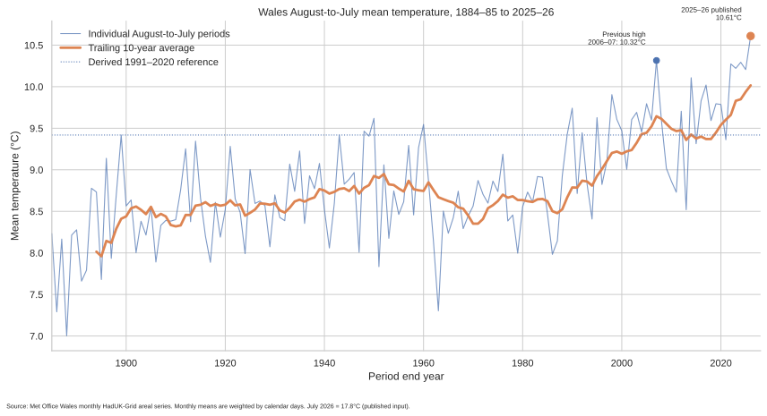

# 001: Tymheredd cymedrig Awst i Orffennaf

## Wales August-to-July mean temperature

**Adroddiad canlyniadau / Results report**

This README is the self-contained public report for Project 001. It explains the question, result, data, historical context, method, validation and limitations without requiring the reader to inspect the source code. More detailed technical records remain available in [`METHODOLOGY.md`](METHODOLOGY.md) and [`VALIDATION.md`](VALIDATION.md).

## Executive summary

The project asks whether the 12 months from **1 August 2025 to 31 July 2026** were the warmest equivalent August-to-July period in the Wales temperature record.

The answer is **yes, with a strong qualification about the precise value**.

The Met Office monthly Wales series currently contains published values through June 2026. July 2026 is therefore represented by an explicitly labelled illustrative scenario rather than being inserted into the official source data. Under a central July scenario of 18.0°C, the August-to-July mean is approximately **10.63°C**. Across the tested July range, the result remains between approximately **10.61°C and 10.65°C**.

The previous highest equivalent period was August 2006 to July 2007, at approximately **10.32°C**. July 2026 would need to average only **14.33°C** for the current period to exceed it. The Met Office had already described July 2026 as tracking as the warmest July on record for Wales, so the historical ranking is robust even though the final mean remains provisional.

This is a secondary calculation from official Met Office data. It is not an official Met Office statistic and it does not reproduce the upstream station quality-control or HadUK-Grid interpolation process.

## Research question

> Was 1 August 2025 to 31 July 2026 the warmest equivalent August-to-July period in the published Wales mean-temperature record?

The comparison is deliberately specific. It ranks like-for-like August-to-July periods first, then separately checks the result against every possible complete monthly-start 12-month window.

<!-- BEGIN GENERATED RESULT -->
## Headline results

**Status:** Provisional calculation using an illustrative July scenario

| Measure | Result |
|---|---:|
| Published source coverage | **January 1884 to June 2026** |
| Illustrative July scenario | **18.0°C** |
| August 2025 to July 2026 mean | **10.63°C** |
| Tested July scenario range | **10.61°C to 10.65°C** |
| Previous August-to-July high | **10.32°C**, 2006-08 to 2007-07 |
| Central-scenario margin over previous high | **+0.31°C** |
| July value needed to exceed previous high | **14.33°C** |
| Rank among equivalent August-to-July periods | **1 of 142** |
| Rank among all monthly-start 12-month windows | **4** |
| Difference from derived 1991-2020 reference | **+1.21°C** |
| Difference from derived 1961-1990 reference | **+2.02°C** |
| Current trailing 10-year average | **10.02°C** |

The exact July Wales area-average is not yet present in the source. The 18.0°C value is an **illustrative scenario**, not a Met Office estimate or a confidence interval.

The record conclusion is already robust: July 2026 would need to average only **14.33°C** to exceed the previous August-to-July high.

### Ten warmest equivalent periods

| Rank | August-to-July period | Mean temperature | Status |
|---:|---|---:|---|
| 1 | 2025-08 to 2026-07 | **10.63°C** | illustrative scenario |
| 2 | 2006-08 to 2007-07 | **10.32°C** | published inputs |
| 3 | 2023-08 to 2024-07 | **10.29°C** | published inputs |
| 4 | 2021-08 to 2022-07 | **10.27°C** | published inputs |
| 5 | 2022-08 to 2023-07 | **10.22°C** | published inputs |
| 6 | 2024-08 to 2025-07 | **10.21°C** | published inputs |
| 7 | 2013-08 to 2014-07 | **10.11°C** | published inputs |
| 8 | 2016-08 to 2017-07 | **10.02°C** | published inputs |
| 9 | 1997-08 to 1998-07 | **9.90°C** | published inputs |
| 10 | 2015-08 to 2016-07 | **9.83°C** | published inputs |
<!-- END GENERATED RESULT -->

## Historical trend since records began



**Figure 1.** Every complete August-to-July period in the published Wales series is shown from 1884-85 onward. The thinner line shows individual 12-month periods. The heavier line shows the trailing 10-year average, which reduces short-term variability and makes the longer-term direction easier to see. The latest point uses the July 2026 illustrative scenario stated in the chart footer.

### How to read the graph

The individual period line is expected to move up and down because temperatures vary substantially from year to year. A single hot or cold period does not by itself define the long-term climate.

The trailing 10-year average answers a different question. It shows whether groups of recent periods are generally warmer or cooler than earlier groups. It is descriptive, not a climate-attribution model, but it makes the broad rise in the Wales series visible without fitting a complicated statistical curve.

The chart also marks:

- the previous equivalent-period high in 2006-07;
- the current 2025-26 illustrative result;
- the repository-derived 1991-2020 reference for the same August-to-July sequence.

## What the results show

### 1. The equivalent-period record is robust

The central scenario gives a mean of approximately 10.63°C, around 0.31°C above the previous August-to-July high. Even the lowest tested July scenario produces approximately 10.61°C, still well above the previous value.

The more important robustness calculation is the break-even point. July would need to average only 14.33°C for the current August-to-July period to exceed the previous record. This is far below the previous published July record of 17.8°C.

The conclusion that this is the warmest August-to-July period therefore does not depend on guessing the final July figure to the nearest tenth or hundredth of a degree.

### 2. Recent warm periods are strongly represented near the top

Six of the ten highest equivalent August-to-July values are the current period or periods ending between 2022 and 2025. This does not replace a formal trend analysis, but it provides useful descriptive context for the full-record graph.

The 2006-07 period remains the highest equivalent period based entirely on published historical inputs. The 2025-26 period moves above it only after adding the clearly labelled July 2026 scenario.

### 3. The result is fourth across all monthly-start 12-month windows

An August-to-July ranking compares each period on the same seasonal sequence. The project also tests every possible complete 12-month window beginning in any calendar month.

Under the central scenario, August 2025 to July 2026 ranks fourth in that broader comparison. Three overlapping 12-month windows around the exceptionally warm 2006-07 period remain slightly higher. This distinction prevents the narrower August-to-July result from being described incorrectly as the warmest possible 12-month window in the entire record.

### 4. The reference-period anomalies are exceptional one-period values

The central scenario is approximately:

- **1.21°C above** the repository-derived 1991-2020 reference for the August-to-July sequence;
- **2.02°C above** the repository-derived 1961-1990 reference.

These are anomalies for one unusually warm 12-month period. They must not be restated as evidence that Wales has permanently warmed by 1.21°C or 2.02°C. Long-term warming is assessed using sustained averages and dedicated climate analyses.

### 5. The exact final mean remains provisional

The final Wales July 2026 monthly area-average was not present in the retained Met Office source when this report was generated. The precise 10.63°C figure can therefore change by a few hundredths when July is published.

The script automatically uses the published July value once it appears in the official monthly series. The retained source is never edited to insert a scenario.

## Data source and provenance

The project uses the Met Office National Climate Information Centre's published monthly, seasonal and annual mean air-temperature series for Wales.

The retained source file is an exact, unmodified HTTP response:

- [`data/raw/metoffice-wales-tmean-source-2026-07-01.txt`](data/raw/metoffice-wales-tmean-source-2026-07-01.txt)
- [`data/raw/metoffice-wales-tmean-source-2026-07-01.provenance.json`](data/raw/metoffice-wales-tmean-source-2026-07-01.provenance.json)

The provenance manifest records the source URL, retrieval time, source update time, HTTP metadata, byte count and SHA-256 digest. The raw source and normalized derived data are kept separate.

The source is a **Wales areal average derived from HadUK-Grid**, not a simple average of a selected set of weather stations. Met Office observations inform regression and interpolation onto a 1 km grid. The cells within Wales are then averaged to create the published national value.

This repository begins with that published Wales series. It does not claim to repeat the station-level quality control, spatial regression or interpolation.

## Method in plain English

The calculation is intentionally simple once the official Wales monthly series has been obtained.

For each August-to-July period:

1. take the twelve published monthly Wales mean temperatures;
2. multiply each monthly value by the number of calendar days in that month;
3. add the twelve temperature-day totals;
4. divide by the total number of days in the period;
5. repeat the calculation for every complete August-to-July period in the record;
6. rank the results from warmest to coolest.

The formula is:

```text
period mean = sum(monthly mean × calendar days) / total calendar days
```

Day weighting matters because calendar months have different lengths and some August-to-July periods include 29 February.

The public monthly series is rounded to 0.1°C. Derived values are therefore reported to 0.01°C, and reference-period comparisons are described approximately rather than with false precision.

## Why monthly area data are used

The question concerns the mean temperature of Wales over a 12-month period. The published monthly Wales area-average is consequently a better input than:

- selecting a few individual stations;
- treating every station as equally representative of Wales;
- attempting to reconstruct the monthly national value from separate daily products;
- averaging hourly readings directly within this repository.

The gridding and area averaging have already been performed upstream by the Met Office. This project performs the secondary historical comparison.

## Validation and confidence

Project 001 was revalidated end to end against an exact-byte Met Office download.

The validation included:

- checking the SHA-256 source digest against the provenance manifest;
- checking complete monthly continuity from January 1884 through June 2026;
- preventing duplicate year-month observations;
- using explicit column positions from the official table header;
- reconstructing annual means from monthly values;
- reconciling those values with the official annual column;
- checking leap-year and calendar-day weighting;
- running the primary pandas implementation;
- running a separate standard-library and `Decimal` implementation;
- comparing the two independently produced results;
- running the complete automated test suite in GitHub Actions.

The results of the validation run were:

| Validation measure | Result |
|---|---:|
| Complete calendar years reconciled | **142** |
| Maximum difference from official annual column | **0.02192°C** |
| Primary and independent period mean agreement | **Pass** |
| Historical rank agreement | **Pass** |
| Break-even July agreement | **Pass** |
| Automated tests | **9 passed** |

The small annual reconciliation differences are expected because the monthly public values are rounded to 0.1°C while the official annual column is published at greater precision.

The permanent machine-readable verification record is available at [`data/derived/independent_verification.json`](data/derived/independent_verification.json).

## Validation boundary

The project validates its use of the published Met Office series and the calculations made from it.

It does not independently validate:

- the calibration of each weather-station instrument;
- the classification or siting of every station;
- every upstream observation correction;
- the HadUK-Grid regression model;
- the construction of the national Wales boundary mask.

Those are upstream Met Office responsibilities. Their documented observation, station and HadUK-Grid validation processes form part of the provenance of the source product.

## Limitations

### Rounded monthly inputs

The public monthly figures are rounded to 0.1°C. Calculations from the published table may differ by a few hundredths from calculations using the underlying unrounded grids. The margin over the previous August-to-July record is large enough that this does not affect the ranking.

### Illustrative July value

The 18.0°C July value is not a forecast, estimate or confidence interval. It is a transparent scenario used to produce a provisional full-period value while the exact month is absent from the published source.

### Descriptive trend

The trailing 10-year line is a descriptive moving average. It is not a formal estimate of the long-term warming rate, a causal attribution analysis or a climate projection.

### National rather than local result

The Wales area-average does not describe every place in Wales equally. Local conditions in Swansea, the uplands, valleys and coastal areas can differ substantially. A later local project should use appropriate HadUK-Grid cells or another documented spatial product rather than treating the national value as Swansea's temperature.

### Dataset revisions

The Met Office may revise provisional or historical values when data and quality-control processes are updated. Each refresh therefore produces a new immutable snapshot rather than silently replacing the retained source.

## Suggested public wording

> I looked at the Met Office Wales monthly mean-temperature series and calculated the mean for the 12 months from 1 August 2025 to 31 July 2026, weighting each month by its number of days. The precise result remains provisional until the final July Wales figure is published, but the ranking is already clear. July would only need to average 14.33°C for this to become the warmest August-to-July period in the Welsh series, which begins in 1884. Under an illustrative July value of 18.0°C, the 12-month mean is approximately 10.63°C, around 1.2°C above the derived 1991-2020 reference for the same sequence of months.

The result should not be shortened to “Wales has warmed by 2°C”. The 2.02°C value is the anomaly of one exceptional 12-month period against the older 1961-1990 reference, not an estimate of permanent long-term warming.

## Reproduce the report

From the repository root:

```bash
python -m venv .venv
source .venv/bin/activate
pip install -e ".[dev]"
python projects/001-rolling-temperature/analysis.py
pytest
```

Run the independent verifier against the retained source:

```bash
python projects/001-rolling-temperature/verify.py \
  --source projects/001-rolling-temperature/data/raw/metoffice-wales-tmean-source-2026-07-01.txt \
  --manifest projects/001-rolling-temperature/data/raw/metoffice-wales-tmean-source-2026-07-01.provenance.json \
  --primary-summary projects/001-rolling-temperature/data/derived/summary.json \
  --require-annual
```

Download a new immutable upstream snapshot and rerun:

```bash
python projects/001-rolling-temperature/analysis.py --refresh
```

A refresh writes a new timestamped source snapshot. It does not silently overwrite a different earlier source file.

## Project outputs

### Public report and technical records

- [`README.md`](README.md), this self-contained public results report
- [`METHODOLOGY.md`](METHODOLOGY.md), detailed observation-to-grid-to-analysis methodology
- [`VALIDATION.md`](VALIDATION.md), end-to-end validation record and acceptance criteria

### Machine-readable results

- [`data/derived/summary.json`](data/derived/summary.json), headline results and source provenance
- [`data/derived/wales_monthly_mean_temperature.csv`](data/derived/wales_monthly_mean_temperature.csv), normalized published monthly inputs
- [`data/derived/august_to_july_mean_temperature.csv`](data/derived/august_to_july_mean_temperature.csv), every equivalent period and rank
- [`data/derived/all_rolling_12_month_windows.csv`](data/derived/all_rolling_12_month_windows.csv), all complete monthly-start 12-month windows
- [`data/derived/july_2026_sensitivity.csv`](data/derived/july_2026_sensitivity.csv), tested July scenarios
- [`data/derived/annual_reconciliation.csv`](data/derived/annual_reconciliation.csv), reconstructed and official annual values
- [`data/derived/independent_verification.json`](data/derived/independent_verification.json), second-implementation verification result

### Graphics

- [`figures/wales_august_to_july_mean_temperature_provisional.svg`](figures/wales_august_to_july_mean_temperature_provisional.svg), scalable public figure
- [`figures/wales_august_to_july_mean_temperature_provisional.png`](figures/wales_august_to_july_mean_temperature_provisional.png), high-resolution raster version

## Technical appendices

The README is intended to stand alone, but the following records provide greater detail:

- [`METHODOLOGY.md`](METHODOLOGY.md) explains the HadUK-Grid provenance boundary, source preservation, weighting, reference periods and independent implementation.
- [`VALIDATION.md`](VALIDATION.md) records the tests, tolerances, source hash, annual reconciliation and verification run.

## Primary sources

- [Met Office Wales monthly, seasonal and annual mean-temperature series](https://www.metoffice.gov.uk/pub/data/weather/uk/climate/datasets/Tmean/date/Wales.txt)
- [HadUK-Grid methods](https://www.metoffice.gov.uk/research/climate/maps-and-data/data/haduk-grid/methods)
- [HadUK-Grid frequently asked questions](https://www.metoffice.gov.uk/research/climate/maps-and-data/data/haduk-grid/faq)
- [Met Office observations, station standards and quality control](https://weather.metoffice.gov.uk/learn-about/how-forecasts-are-made/observations/obs-critical-for-weather--climate)
- [Reproducible Analytical Pipelines, Code of Practice for Statistics](https://code.statisticsauthority.gov.uk/case-studies/using-reproducible-analytical-pipelines-rap-to-improve-statistics/)

## Licensing and independence

The Met Office source data remain Crown copyright and subject to their original licence. The analysis code is released under the repository's MIT licence.

Hinsawdd Cymru is independent and is not an official Met Office product. Derived results should be described as calculations from Met Office data, not as figures published or endorsed by the Met Office.
