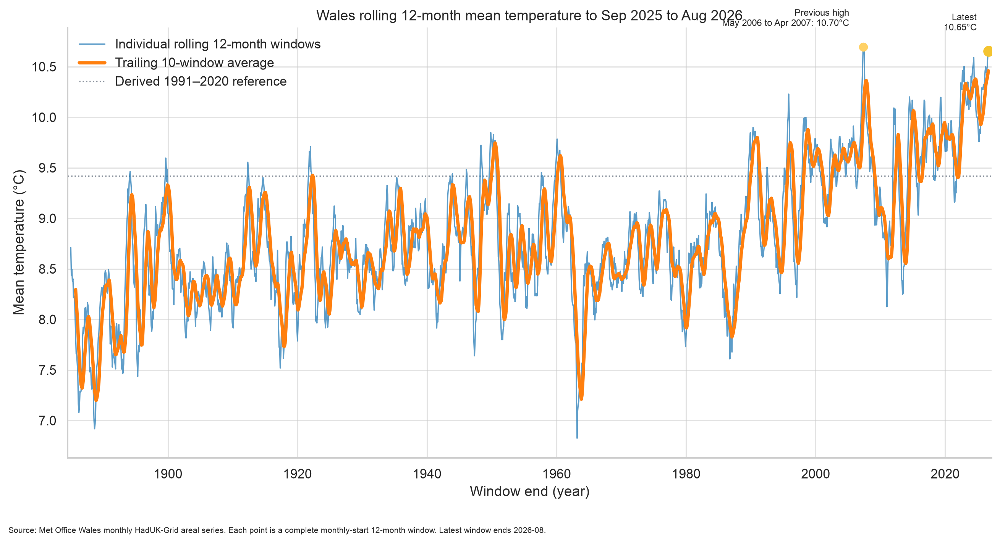
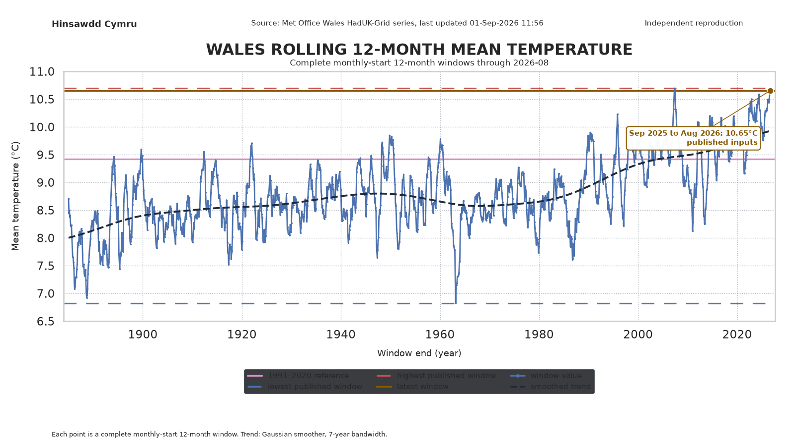
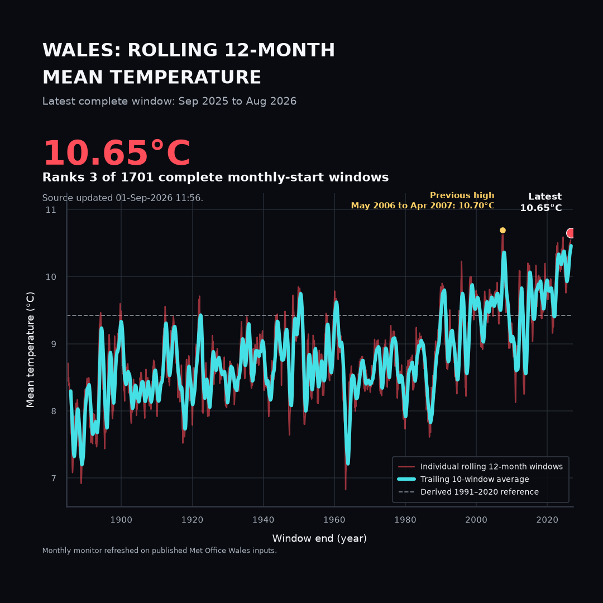
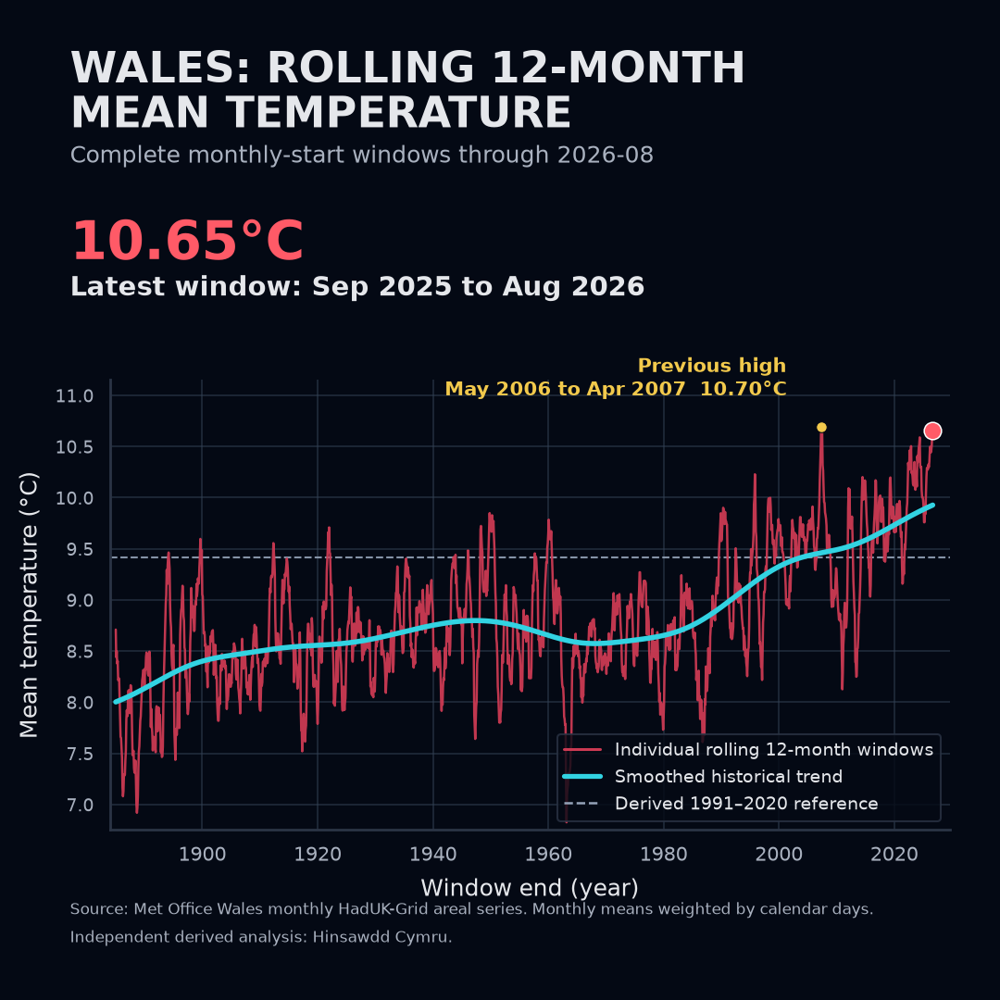

# 001: Tymheredd cymedrig 12 mis yn olwynu

## Wales rolling 12-month mean temperature (monthly monitor)

**Adroddiad canlyniadau / Results report**

This README is the live monthly monitor for Project 001. Each refresh uses the latest published Met Office Wales monthly mean-temperature series and reports the **most recent complete monthly-start 12-month window** — currently **September 2025 to August 2026**.

The original August-to-July 2025–26 research report is archived at [`archive/august-to-july-2025-26/`](archive/august-to-july-2025-26/ARCHIVE.md).

## Executive summary

The monitor tracks Wales mean air temperature over every complete rolling 12-month window aligned to calendar month-ends. When the Met Office publishes a new monthly value, the headline window advances by one month.

**Latest complete window (published inputs):** **September 2025 to August 2026** — **10.65°C**, **3rd warmest** of **1,701** complete monthly-start windows in the record.

The previous archived August-to-July report found that **August 2025 to July 2026** was the warmest equivalent August-to-July period (**10.61°C**, **1st of 142**). That narrower seasonal comparison remains available in the archive; this live monitor uses the broader monthly rolling definition.

This is a secondary calculation from official Met Office data. It is not an official Met Office statistic and it does not reproduce the upstream station quality-control or HadUK-Grid interpolation process.

## Research question

> What is the Wales mean temperature over the latest complete rolling 12-month window ending on the last published calendar month, and how does it rank in the historical record?

Each month, when Met Office Wales monthly data are updated, the project:

1. retains an immutable source snapshot;
2. recalculates every complete monthly-start 12-month window;
3. publishes the latest window, its rank and supporting charts.

<!-- BEGIN GENERATED RESULT -->
## Headline results

**Status:** Published-input calculation
**Monitor cadence:** Monthly refresh on published Met Office Wales monthly data
**Latest complete window:** **Sep 2025 to Aug 2026**

| Measure | Result |
|---|---:|
| Published source coverage | **January 1884 to August 2026** |
| Latest 12-month mean | **10.65°C** |
| Rank among all monthly-start 12-month windows | **3 of 1701** |
| Previous record window | **10.70°C**, May 2006 to Apr 2007 |
| Margin over previous record | **-0.04°C** |
| Difference from derived 1991–2020 reference | **+1.23°C** |
| Difference from derived 1961–1990 reference | **+2.04°C** |
| Current trailing 10-window average | **10.46°C** |

The headline window ends on the **last published calendar month** in the retained Met Office source (August 2026). Each refresh advances the window by one month when a new monthly value is published.

### Archived August-to-July report

The original August-to-July 2025–26 research question is preserved in [`archive/august-to-july-2025-26/`](archive/august-to-july-2025-26/ARCHIVE.md): warmest equivalent August-to-July period at **10.61°C** (1 of 142).

### Ten warmest rolling 12-month windows

| Rank | 12-month window | Mean temperature | Status |
|---:|---|---:|---|
| 1 | May 2006 to Apr 2007 | **10.70°C** | published inputs |
| 2 | Jun 2006 to May 2007 | **10.69°C** | published inputs |
| 3 | Sep 2025 to Aug 2026 | **10.65°C** | published inputs |
| 4 | Jul 2006 to Jun 2007 | **10.65°C** | published inputs |
| 5 | Aug 2025 to Jul 2026 | **10.61°C** | published inputs |
| 6 | Jun 2023 to May 2024 | **10.59°C** | published inputs |
| 7 | May 2023 to Apr 2024 | **10.52°C** | published inputs |
| 8 | Jul 2025 to Jun 2026 | **10.51°C** | published inputs |
| 9 | Dec 2021 to Nov 2022 | **10.50°C** | published inputs |
| 10 | Apr 2025 to Mar 2026 | **10.50°C** | published inputs |
<!-- END GENERATED RESULT -->

<!-- BEGIN REFRESH HISTORY -->
## Refresh history

Each monthly refresh is frozen under [`runs/`](runs/index.json). The table below lists isolated run folders; live `figures/` always shows the latest refresh.

| Run | Headline window | Mean | Rank | Note |
|---|---|---:|---:|---|
| [2026-08](runs/2026-08/RUN.md) | Sep 2025 to Aug 2026 | **10.65°C** | 3 of 1701 | [manifest](runs/2026-08/manifest.json) |
<!-- END REFRESH HISTORY -->

<!-- BEGIN LINE CHART PREVIEWS -->
## Monthly monitor charts

<!-- BEGIN CHART PREVIEW NOTE -->
These are **rolling 12-month windows** (monthly-start), not the archived August-to-July seasonal series. The headline window ends on the **last published calendar month** (August 2026).
<!-- END CHART PREVIEW NOTE -->

<a href="figures/wales_rolling_12_month_temperature_history.png"></a>

[Open the history chart as SVG](figures/wales_rolling_12_month_temperature_history.svg)

<a href="figures/wales_rolling_12_month_temperature_line_chart.png"></a>

[Open the standard line chart as SVG](figures/wales_rolling_12_month_temperature_line_chart.svg)

<p align="center"><a href="figures/wales_rolling_12_month_temperature_square_dark.png"></a></p>

[Open the dark-mode chart as SVG](figures/wales_rolling_12_month_temperature_square_dark.svg)

<p align="center"><a href="figures/wales_rolling_12_month_temperature_line_chart_square_dark.png"></a></p>

[Open the dark-mode line chart as SVG](figures/wales_rolling_12_month_temperature_line_chart_square_dark.svg)

Each point is one complete monthly-start 12-month window.

<!-- END LINE CHART PREVIEWS -->

## Historical trend since records began

**Figure 1.** Complete monthly-start 12-month windows from 1884 to the latest published month (see chart previews above). The archived August-to-July seasonal view remains at [`archive/august-to-july-2025-26/`](archive/august-to-july-2025-26/ARCHIVE.md).

### How to read the graph

The thinner blue line shows individual monthly-start 12-month windows. Short-term ups and downs are normal; one warm window does not by itself define long-term climate.

The orange **trailing 10-window average** smooths groups of ten consecutive windows. It is descriptive, not a formal attribution model, but it makes the broad rise in the Wales series easier to see.

The chart also marks:

- the previous record rolling window (currently May 2006 to April 2007 at 10.70°C);
- the latest complete window (currently September 2025 to August 2026);
- the repository-derived 1991–2020 reference for the same month sequence.

## What the results show

### 1. The latest rolling window is exceptionally warm

**September 2025 to August 2026** averages **10.65°C** on published Met Office monthly values. It ranks **3rd** among all **1,701** complete monthly-start 12-month windows. The record holder remains **May 2006 to April 2007** at **10.70°C**.

### 2. The archived August-to-July result still stands

The frozen August-to-July report concluded that **August 2025 to July 2026** was the warmest equivalent August-to-July period at **10.61°C** (**1st of 142**). That seasonal boundary answered a specific research question and is preserved in the archive.

### 3. Recent warm windows cluster near the top

Six of the ten warmest rolling windows end between 2021 and 2026. This is descriptive context, not a formal attribution analysis.

### 4. Reference-period anomalies are one-window values

The latest window is approximately **+1.23°C** above the repository-derived 1991–2020 reference for the same month sequence and **+2.04°C** above the 1961–1990 reference. These are anomalies for one 12-month period, not long-term warming rates.

### 5. Dataset revisions remain possible

The Met Office may revise provisional or historical values when quality-control processes are updated. Each refresh produces a new immutable snapshot rather than silently replacing the retained source.
## Data source and provenance

The project uses the Met Office National Climate Information Centre's published monthly, seasonal and annual mean air-temperature series for Wales.

The retained source file is an exact, unmodified HTTP response:

- [`data/raw/metoffice-wales-tmean-retrieved-2026-09-01T230334Z.txt`](data/raw/metoffice-wales-tmean-retrieved-2026-09-01T230334Z.txt)
- [`data/raw/metoffice-wales-tmean-retrieved-2026-09-01T230334Z.provenance.json`](data/raw/metoffice-wales-tmean-retrieved-2026-09-01T230334Z.provenance.json)

The provenance manifest records the source URL, retrieval time, source update time, HTTP metadata, byte count and SHA-256 digest. The raw source and normalized derived data are kept separate.

The source is a **Wales areal average derived from HadUK-Grid**, not a simple average of a selected set of weather stations. Met Office observations inform regression and interpolation onto a 1 km grid. The cells within Wales are then averaged to create the published national value.

This repository begins with that published Wales series. It does not claim to repeat the station-level quality control, spatial regression or interpolation.

## Method in plain English

The calculation is intentionally simple once the official Wales monthly series has been obtained.

For each complete monthly-start 12-month window:

1. take the twelve published monthly Wales mean temperatures;
2. multiply each monthly value by the number of calendar days in that month;
3. add the twelve temperature-day totals;
4. divide by the total number of days in the window;
5. repeat for every complete window in the record;
6. rank the results from warmest to coolest.

The formula is:

```text
window mean = sum(monthly mean × calendar days) / total calendar days
```

Day weighting matters because calendar months have different lengths and some windows include 29 February.

The public monthly series is rounded to 0.1°C. Derived values are therefore reported to 0.01°C, and reference-period comparisons are described approximately rather than with false precision.

## Why monthly area data are used

The question concerns the mean temperature of Wales over a 12-month period. The published monthly Wales area-average is consequently a better input than:

- selecting a few individual stations;
- treating every station as equally representative of Wales;
- attempting to reconstruct the monthly national value from separate daily products;
- averaging hourly readings directly within this repository.

The gridding and area averaging have already been performed upstream by the Met Office. This project performs the secondary historical comparison.

## Validation and confidence

Project 001 was revalidated end to end against an exact-byte Met Office download.

The validation included:

- checking the SHA-256 source digest against the provenance manifest;
- checking complete monthly continuity from January 1884 through August 2026;
- preventing duplicate year-month observations;
- using explicit column positions from the official table header;
- reconstructing annual means from monthly values;
- reconciling those values with the official annual column;
- checking leap-year and calendar-day weighting;
- running the primary pandas implementation;
- running a separate standard-library and `Decimal` implementation;
- comparing the two independently produced results;
- running the complete automated test suite in GitHub Actions.

The results of the validation run were:

| Validation measure | Result |
|---|---:|
| Complete calendar years reconciled | **142** |
| Maximum difference from official annual column | **0.02192°C** |
| Primary and independent period mean agreement | **Pass** |
| Historical rank agreement | **Pass** |
| Break-even July agreement | **Pass** |
| Automated tests | **43 passed** |

The small annual reconciliation differences are expected because the monthly public values are rounded to 0.1°C while the official annual column is published at greater precision.

The permanent machine-readable verification record is available at [`data/derived/independent_verification.json`](data/derived/independent_verification.json).

## Validation boundary

The project validates its use of the published Met Office series and the calculations made from it.

It does not independently validate:

- the calibration of each weather-station instrument;
- the classification or siting of every station;
- every upstream observation correction;
- the HadUK-Grid regression model;
- the construction of the national Wales boundary mask.

Those are upstream Met Office responsibilities. Their documented observation, station and HadUK-Grid validation processes form part of the provenance of the source product.

## Limitations

### Rounded monthly inputs

The public monthly figures are rounded to 0.1°C. Calculations from the published table may differ by a few hundredths from calculations using the underlying unrounded grids. This rounding does not change the headline ranking at the precision reported here.

### Published July 2026

July 2026 is now present in the retained Met Office source at **17.8°C**. Earlier refreshes used an illustrative 18.0°C scenario only while the month was absent from the published monthly table; that scenario is no longer used when the official value is available.

### Descriptive trend

The trailing 10-window line is a descriptive moving average over consecutive rolling windows. It is not a formal estimate of the long-term warming rate, a causal attribution analysis or a climate projection.

### National rather than local result

The Wales area-average does not describe every place in Wales equally. Local conditions in Swansea, the uplands, valleys and coastal areas can differ substantially. A later local project should use appropriate HadUK-Grid cells or another documented spatial product rather than treating the national value as Swansea's temperature.

### Dataset revisions

The Met Office may revise provisional or historical values when data and quality-control processes are updated. Each refresh therefore produces a new immutable snapshot rather than silently replacing the retained source.

## Reproduce the report

From the repository root:

```bash
python -m venv .venv
source .venv/bin/activate
pip install -e ".[dev]"
python projects/001-rolling-temperature/refresh.py
pytest projects/001-rolling-temperature/tests
```

`refresh.py` runs `analysis.py`, `verify.py`, `monthly_monitor.py` (including rolling line charts), snapshots the refresh under `runs/YYYY-MM/`, and updates the generated README blocks. August-to-July archive figures remain in [`archive/august-to-july-2025-26/`](archive/august-to-july-2025-26/ARCHIVE.md).

Run the independent verifier against the retained source:

```bash
python projects/001-rolling-temperature/verify.py \
  --source projects/001-rolling-temperature/data/raw/metoffice-wales-tmean-retrieved-2026-09-01T230334Z.txt \
  --manifest projects/001-rolling-temperature/data/raw/metoffice-wales-tmean-retrieved-2026-09-01T230334Z.provenance.json \
  --primary-summary projects/001-rolling-temperature/data/derived/summary.json \
  --require-annual
```

Download a new immutable upstream snapshot and rerun:

```bash
python projects/001-rolling-temperature/refresh.py --fetch
```

A refresh writes a new timestamped source snapshot. It does not silently overwrite a different earlier source file.

## Project outputs

### Public report and technical records

- [`README.md`](README.md), this self-contained public results report
- [`METHODOLOGY.md`](METHODOLOGY.md), detailed observation-to-grid-to-analysis methodology
- [`VALIDATION.md`](VALIDATION.md), end-to-end validation record and acceptance criteria

### Analysis and figure code

- [`refresh.py`](refresh.py), monthly refresh orchestrator (analyse, verify, render, snapshot, update README)
- [`analysis.py`](analysis.py), primary calculation and derived outputs
- [`monthly_monitor.py`](monthly_monitor.py), rolling history and dark social figures
- [`rolling_line_chart.py`](rolling_line_chart.py), standard and square dark rolling line charts
- [`snapshot_run.py`](snapshot_run.py), freeze each refresh under `runs/YYYY-MM/`
- [`trend_charts.py`](trend_charts.py), shared light/dark trend renderers
- [`figure_style.py`](figure_style.py) and [`FIGURE_STYLE.md`](FIGURE_STYLE.md), colours, dimensions and legend rules
- [`social_chart.py`](social_chart.py), archived August-to-July square dark figure
- [`line_chart_variants.py`](line_chart_variants.py), archived August-to-July line charts
- [`warming_stripes.py`](warming_stripes.py), calendar-year stripes and temperature bars
- [`august_to_july_stripes.py`](august_to_july_stripes.py), archived August-to-July stripes and bars
- [`verify.py`](verify.py), independent standard-library and `Decimal` verification

### Machine-readable results

- [`data/derived/summary.json`](data/derived/summary.json), headline results and source provenance
- [`data/derived/wales_monthly_mean_temperature.csv`](data/derived/wales_monthly_mean_temperature.csv), normalized published monthly inputs
- [`data/derived/rolling_12_month_mean_temperature.csv`](data/derived/rolling_12_month_mean_temperature.csv), complete monthly-start 12-month windows
- [`data/derived/wales_rolling_12_month_temperature_line_chart.csv`](data/derived/wales_rolling_12_month_temperature_line_chart.csv), presentation data for rolling line charts
- [`data/derived/august_to_july_mean_temperature.csv`](data/derived/august_to_july_mean_temperature.csv), archived August-to-July periods (see `archive/`)
- [`data/derived/all_rolling_12_month_windows.csv`](data/derived/all_rolling_12_month_windows.csv), all complete monthly-start 12-month windows
- [`data/derived/july_2026_sensitivity.csv`](data/derived/july_2026_sensitivity.csv), tested July scenarios
- [`data/derived/annual_reconciliation.csv`](data/derived/annual_reconciliation.csv), reconstructed and official annual values
- [`data/derived/wales_calendar_year_warming_stripes.csv`](data/derived/wales_calendar_year_warming_stripes.csv), calendar-year reference and anomalies used by the retained calendar graphics
- [`data/derived/wales_august_to_july_warming_stripes.csv`](data/derived/wales_august_to_july_warming_stripes.csv), August-to-July reference, anomalies and published/provisional status used by the new graphics
- [`data/derived/wales_august_to_july_temperature_line_chart.csv`](data/derived/wales_august_to_july_temperature_line_chart.csv), presentation data and descriptive smoothed trend used by both line-chart variants
- [`data/derived/independent_verification.json`](data/derived/independent_verification.json), second-implementation verification result

### Graphics

Live rolling monitor figures (`figures/`):

- `figures/wales_rolling_12_month_temperature_history.{png,svg}`
- `figures/wales_rolling_12_month_temperature_square_dark.{png,svg}`
- `figures/wales_rolling_12_month_temperature_line_chart.{png,svg}`
- `figures/wales_rolling_12_month_temperature_line_chart_square_dark.{png,svg}`

Frozen per refresh under [`runs/`](runs/index.json). Archived August-to-July figures live in [`archive/august-to-july-2025-26/figures/`](archive/august-to-july-2025-26/figures/).

Calendar-year and archived August-to-July warming stripes:

- [`WARMING_STRIPES.md`](WARMING_STRIPES.md), full-width clickable previews of all retained PNG assets and links to their SVG counterparts
- `figures/wales_august_to_july_warming_stripes.{png,svg}`
- `figures/wales_august_to_july_warming_stripes_explained.{png,svg}`
- `figures/wales_august_to_july_temperature_bars.{png,svg}`
- `figures/wales_august_to_july_temperature_bars_explained.{png,svg}`

## Technical appendices

The README is intended to stand alone, but the following records provide greater detail:

- [`METHODOLOGY.md`](METHODOLOGY.md) explains the HadUK-Grid provenance boundary, source preservation, weighting, reference periods and independent implementation.
- [`VALIDATION.md`](VALIDATION.md) records the tests, tolerances, source hash, annual reconciliation and verification run.

## Primary sources

- [Met Office Wales monthly, seasonal and annual mean-temperature series](https://www.metoffice.gov.uk/pub/data/weather/uk/climate/datasets/Tmean/date/Wales.txt)
- [HadUK-Grid methods](https://www.metoffice.gov.uk/research/climate/maps-and-data/data/haduk-grid/methods)
- [HadUK-Grid frequently asked questions](https://www.metoffice.gov.uk/research/climate/maps-and-data/data/haduk-grid/faq)
- [Met Office observations, station standards and quality control](https://weather.metoffice.gov.uk/learn-about/how-forecasts-are-made/observations/obs-critical-for-weather--climate)
- [Reproducible Analytical Pipelines, Code of Practice for Statistics](https://code.statisticsauthority.gov.uk/case-studies/using-reproducible-analytical-pipelines-rap-to-improve-statistics/)

## Licensing and independence

The Met Office source data remain Crown copyright and subject to their original licence. The analysis code is released under the repository's MIT licence.

Hinsawdd Cymru is independent and is not an official Met Office product. Derived results should be described as calculations from Met Office data, not as figures published or endorsed by the Met Office.
