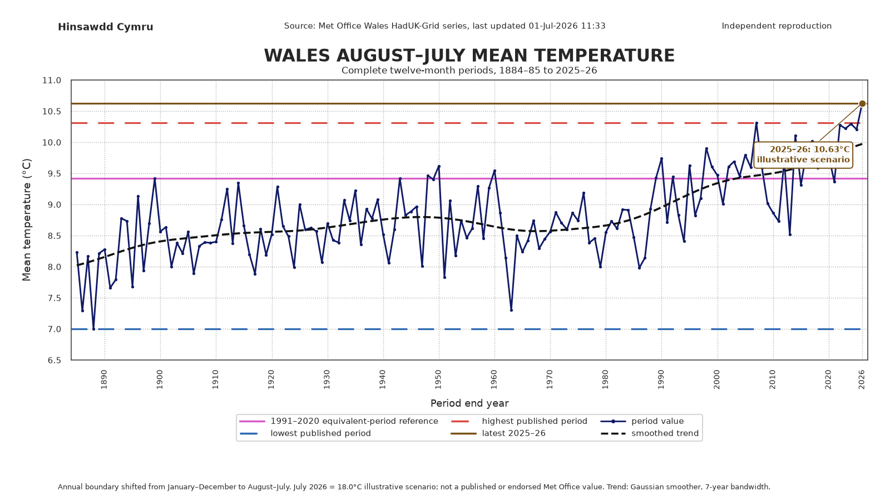

# Wales August-to-July mean-temperature line chart

This reproducible Project 001 graphic presents the validated Wales temperature series in a conventional historical line-chart format while retaining the project's August-to-July annual boundary.

<a href="figures/wales_august_to_july_mean_temperature_line_chart.png"></a>

[Open the chart as SVG](figures/wales_august_to_july_mean_temperature_line_chart.svg)

## What the chart represents

Each connected point is one complete twelve-month period:

- August 1884 to July 1885;
- August 1885 to July 1886;
- continuing through August 2025 to July 2026.

The chart therefore differs from a normal January-to-December calendar-year chart. The annual boundary has been shifted so the latest complete equivalent period can end in July 2026.

The graphic includes:

- every August-to-July mean temperature in the validated derived series;
- the existing validated Project 001 1991–2020 reference for the August-to-July target sequence;
- the lowest and highest periods based entirely on published Met Office monthly inputs;
- the latest 2025–26 result as a separate horizontal line and labelled point;
- a deterministic Gaussian-smoothed line to make the broad historical direction easier to see.

The 1991–2020 guide is read directly from `summary.json`. Project 001 derives it from the published 1991–2020 monthly climatology and applies the calendar-day weights of the August-to-July target sequence. The presentation script does not define a second reference calculation.

The smoothed line is descriptive presentation, not a climate projection, attribution model or estimate of a formal warming rate.

## July 2026 status

The official Met Office Wales monthly source is still published only through June 2026 and is marked `Last updated 01-Jul-2026 11:33`.

The final 2025–26 point therefore uses the existing **18.0°C illustrative July 2026 scenario** retained by Project 001. It is labelled `illustrative scenario` on the chart. The value is not inserted into the official raw source and must not be described as a figure published, estimated or endorsed by the Met Office.

Once an official July value appears, `analysis.py` will use it automatically and this presentation chart will inherit the updated validated series.

## Data and method boundary

`equivalent_period_chart.py` is presentation-layer code. It reads:

- `data/derived/august_to_july_mean_temperature.csv`;
- `data/derived/summary.json`.

It does not calculate the monthly data or create a second August-to-July scientific method. The underlying means remain calendar-day weighted by `analysis.py`.

The lowest and highest guide lines exclude the provisional final period and therefore describe published-input historical extrema. The latest line is shown separately so that the provisional scenario cannot be mistaken for a published historical maximum.

## Reproduce

From the repository root, after generating the main Project 001 outputs:

```bash
python projects/001-rolling-temperature/analysis.py
python projects/001-rolling-temperature/equivalent_period_chart.py
```

Generated outputs:

- `figures/wales_august_to_july_mean_temperature_line_chart.png`, exactly 1600 × 900;
- `figures/wales_august_to_july_mean_temperature_line_chart.svg`;
- `data/derived/wales_august_to_july_temperature_line_chart.csv`.

## Source and independence

Source data: Met Office National Climate Information Centre, Wales monthly HadUK-Grid areal mean-temperature series.

Hinsawdd Cymru is independent. This is a reproducible adaptation calculated from Met Office data, not an official Met Office product.
