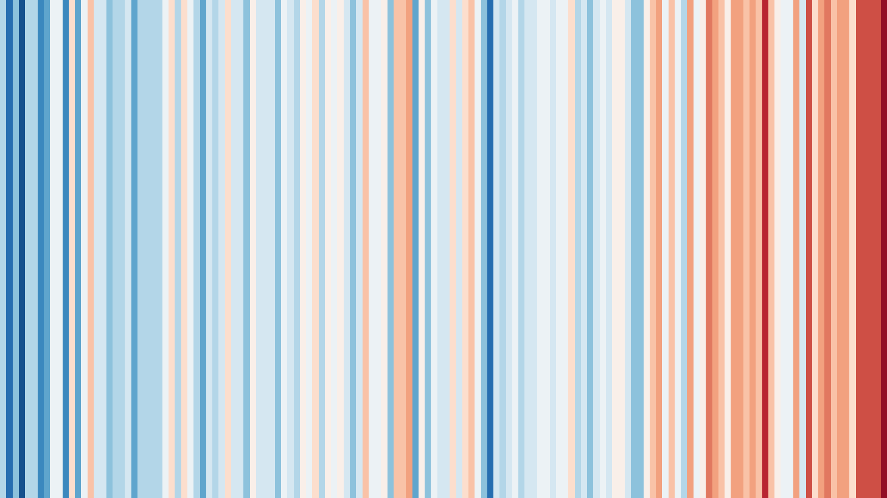
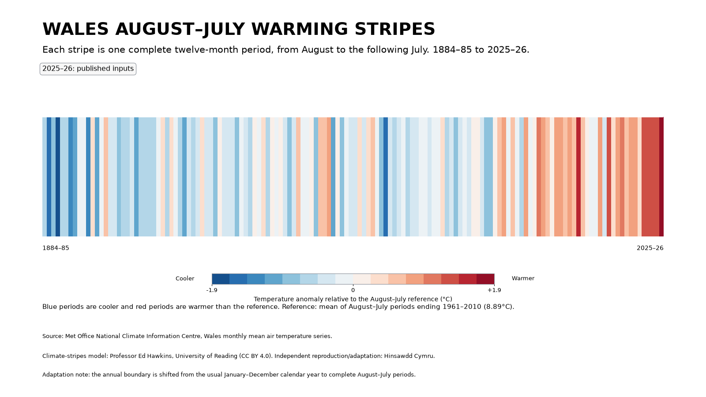
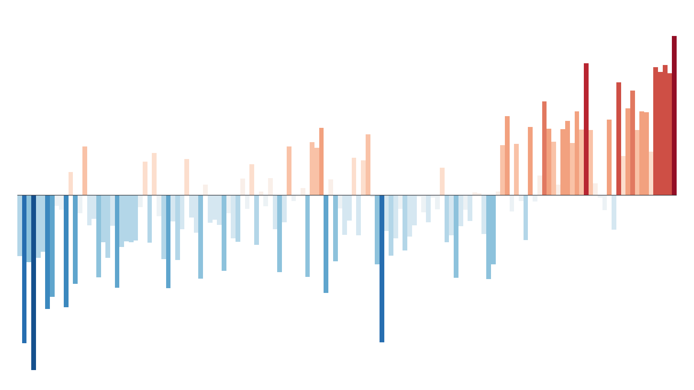
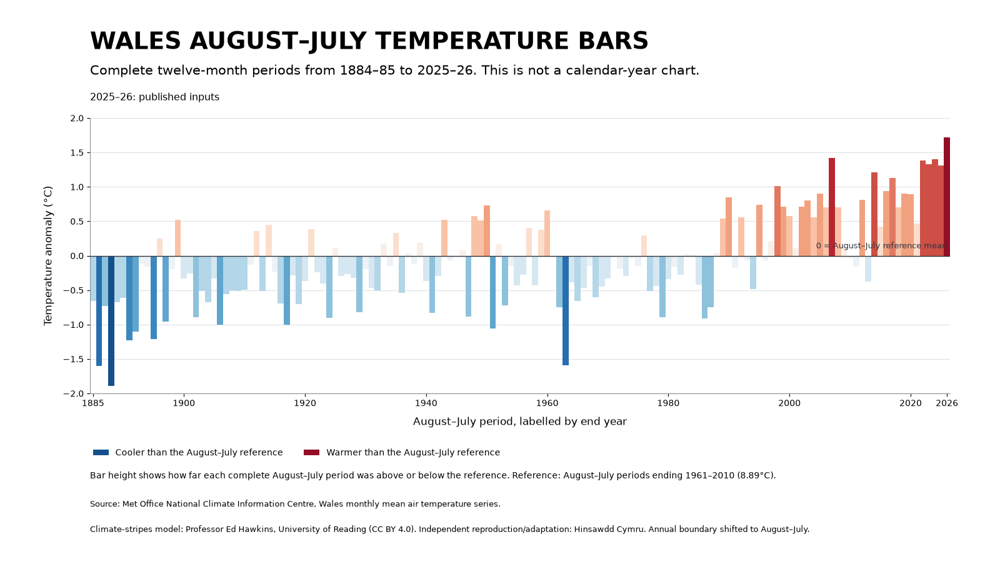

# Wales warming stripes and temperature bars

These reproducible Project 001 graphics follow the climate-stripes model created by Professor Ed Hawkins at the University of Reading. Matplotlib renders every stripe, bar, annotation, scale, legend and layout; Seaborn supplies the restrained blue-to-red palette.

The inline PNG previews are scaled by GitHub. Each preview is clickable and opens the full 1600 × 900 raster asset. SVG versions are linked beneath the corresponding preview.

## Calendar-year graphics

Show Your Stripes normally represents complete **January–December calendar years**. These retained assets use the official Met Office Wales annual mean-temperature values from 1884 through the latest complete published calendar year. Their reference is the calendar-year average for 1961–2010.

### Pure calendar-year warming stripes

<a href="figures/wales_calendar_year_warming_stripes.png"></a>

[Open the calendar-year stripes as SVG](figures/wales_calendar_year_warming_stripes.svg)

The pure version deliberately removes words, numbers and axes. Each vertical stripe represents one January–December calendar year.

### Explained calendar-year warming stripes

<a href="figures/wales_calendar_year_warming_stripes_labelled.png"></a>

[Open the explained calendar-year stripes as SVG](figures/wales_calendar_year_warming_stripes_labelled.svg)

This version adds the date range, first and last years, a Celsius colour scale, interpretation, source and attribution.

### Minimal calendar-year temperature bars

<a href="figures/wales_calendar_year_temperature_bars.png"></a>

[Open the calendar-year bars as SVG](figures/wales_calendar_year_temperature_bars.svg)

The bars use the same calendar-year anomalies and colours as the stripes. Their variable height also shows the size and direction of each annual difference.

### Explained calendar-year temperature bars

<a href="figures/wales_calendar_year_temperature_bars_with_scale.png"></a>

[Open the explained calendar-year bars as SVG](figures/wales_calendar_year_temperature_bars_with_scale.svg)

This version adds calendar-year labels, a zero line, Celsius axis, cooler/warmer legend, source and attribution.

## August-to-July graphics

This adaptation shifts the annual boundary from January–December to **August–July**. Both approaches still compare complete twelve-month periods. Moving the boundary allows the equivalent-period sequence to run from **August 1884–July 1885** through **August 2025–July 2026**.

Each mean is the existing calendar-day-weighted value produced by `analysis.py`. The graphics read `data/derived/august_to_july_mean_temperature.csv`; they do not introduce a second scientific calculation.

The August-to-July colour and bar reference is the mean of the **50 complete August–July periods ending from 1961 through 2010**, inclusive. This equivalent-period reference is calculated from the August-to-July series, not copied from the calendar-year annual reference.

The retained Met Office source currently contains published Wales monthly values only through June 2026. The final **2025–26** period therefore uses the existing clearly declared **18.0°C illustrative July 2026 scenario** and is marked provisional. The scenario is not inserted into the official raw source and is not a Met Office estimate or endorsement.

### Pure August-to-July warming stripes

<a href="figures/wales_august_to_july_warming_stripes.png"></a>

[Open the August-to-July stripes as SVG](figures/wales_august_to_july_warming_stripes.svg)

Each stripe is one complete August-to-July period, oldest on the left and newest on the right.

### Explained August-to-July warming stripes

<a href="figures/wales_august_to_july_warming_stripes_explained.png"></a>

[Open the explained August-to-July stripes as SVG](figures/wales_august_to_july_warming_stripes_explained.svg)

This version explains the shifted boundary, equivalent-period reference, cooler-blue and warmer-red scale, data source, attribution and final-period status.

### Minimal August-to-July temperature bars

<a href="figures/wales_august_to_july_temperature_bars.png"></a>

[Open the August-to-July bars as SVG](figures/wales_august_to_july_temperature_bars.svg)

Each variable-height bar represents one complete August-to-July period. Blue bars are below the equivalent-period reference and red bars are above it.

### Explained August-to-July temperature bars

<a href="figures/wales_august_to_july_temperature_bars_explained.png"></a>

[Open the explained August-to-July bars as SVG](figures/wales_august_to_july_temperature_bars_explained.svg)

Bar height shows how far each complete twelve-month period was above or below the August-to-July reference mean. The chart explicitly distinguishes these periods from calendar years.

## Reproduce

From the repository root:

```bash
python projects/001-rolling-temperature/analysis.py
python projects/001-rolling-temperature/warming_stripes.py
python projects/001-rolling-temperature/august_to_july_stripes.py
```

The August-to-July presentation script creates:

- `figures/wales_august_to_july_warming_stripes.{png,svg}`
- `figures/wales_august_to_july_warming_stripes_explained.{png,svg}`
- `figures/wales_august_to_july_temperature_bars.{png,svg}`
- `figures/wales_august_to_july_temperature_bars_explained.{png,svg}`
- `data/derived/wales_august_to_july_warming_stripes.csv`

The derived CSV records start year, end year, compact period label, August-to-July mean, precise reference definition, reference mean, anomaly and status for every period.

## Attribution and licence

Climate-stripes design and model: **Professor Ed Hawkins, National Centre for Atmospheric Science, University of Reading**.

The University of Reading's Show Your Stripes graphics are licensed under **CC BY 4.0**, which permits sharing and adaptation with attribution. Hinsawdd Cymru is an independent reproduction and August-to-July adaptation using the Met Office Wales mean-temperature series.

References:

- [University of Reading: Climate stripes](https://www.reading.ac.uk/planet/climate-resources/climate-stripes)
- [Show Your Stripes: Wales](https://showyourstripes.info/l/europe/unitedkingdom/wales/)
