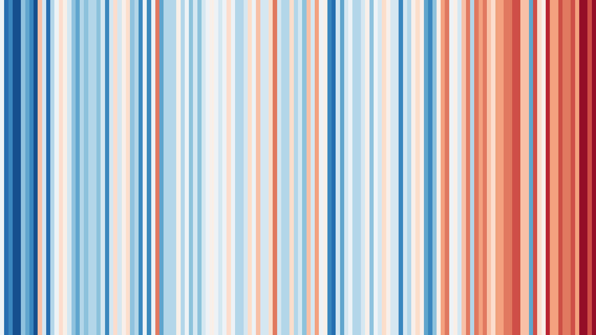
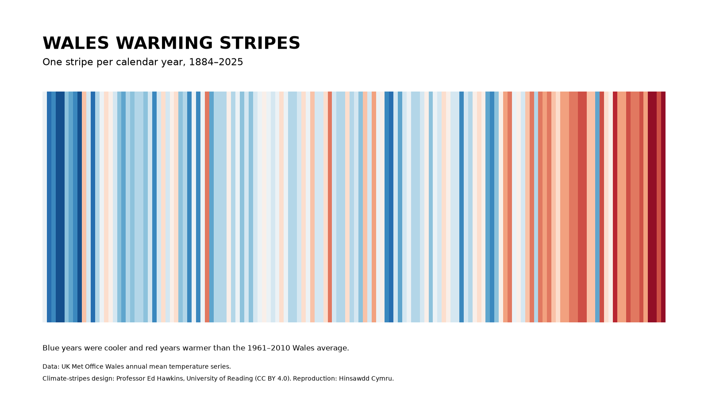
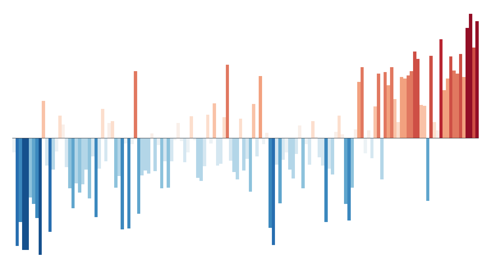
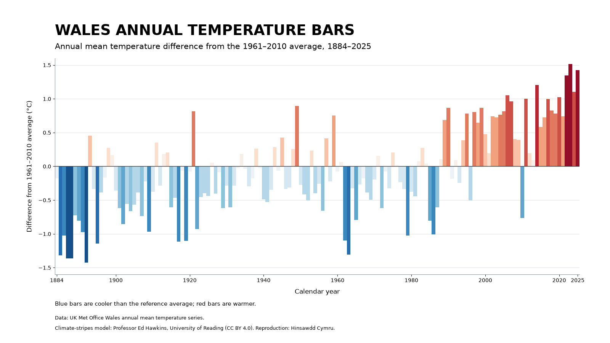

# Wales calendar-year warming stripes and bars

These are additional visualizations for Project 001, following the climate-stripes model created by Professor Ed Hawkins at the University of Reading.

Each asset is generated from the same validated official Met Office Wales annual mean-temperature values. The inline previews below are scaled by GitHub, while the linked PNG and SVG files retain their full resolution.

## Warming stripes

<a href="figures/wales_calendar_year_warming_stripes.png"></a>

The pure version deliberately removes words, numbers and axes. Each vertical stripe represents one calendar year.

## Labelled warming stripes

<a href="figures/wales_calendar_year_warming_stripes_labelled.png"></a>

This version keeps the stripes but adds the date range, a plain-language explanation, data source and attribution.

## Temperature bars

<a href="figures/wales_calendar_year_temperature_bars.png"></a>

The bars use the same colours and data as the stripes, but their height also shows how far each year was above or below the reference average. This is the minimal bars version, without axes or labels.

## Temperature bars with scale

<a href="figures/wales_calendar_year_temperature_bars_with_scale.png"></a>

This version adds a zero line, calendar-year labels and a Celsius scale. It is the clearest asset for readers who want to see both the direction and the size of the annual differences.

## What the colours and bars mean

Each vertical stripe or bar represents one **calendar year** in the official Met Office Wales annual mean-temperature series, from 1884 through the latest complete published calendar year.

The colour and bar height represent that year's temperature relative to the Wales average for **1961–2010**:

- blue: cooler than the 1961–2010 average;
- red: warmer than the 1961–2010 average;
- bars below zero: cooler than the reference average;
- bars above zero: warmer than the reference average.

## Important distinction from the main analysis

These graphics use **complete calendar years and official annual values only**. They do not include the provisional July 2026 scenario and do not answer the project's narrower August-to-July ranking question.

The views are complementary:

- `analysis.py` asks whether August 2025 to July 2026 is the warmest equivalent August-to-July period;
- `warming_stripes.py` shows the long-term calendar-year pattern as stripes and annual anomaly bars.

## Reproduce

From the repository root, after running the main analysis:

```bash
python projects/001-rolling-temperature/analysis.py
python projects/001-rolling-temperature/warming_stripes.py
```

Generated outputs:

- `figures/wales_calendar_year_warming_stripes.png`
- `figures/wales_calendar_year_warming_stripes.svg`
- `figures/wales_calendar_year_warming_stripes_labelled.png`
- `figures/wales_calendar_year_warming_stripes_labelled.svg`
- `figures/wales_calendar_year_temperature_bars.png`
- `figures/wales_calendar_year_temperature_bars.svg`
- `figures/wales_calendar_year_temperature_bars_with_scale.png`
- `figures/wales_calendar_year_temperature_bars_with_scale.svg`
- `data/derived/wales_calendar_year_warming_stripes.csv`

The derived CSV records the official annual value, reference mean and anomaly used for every stripe and bar.

## Attribution and licence

Climate-stripes design and model: **Professor Ed Hawkins, National Centre for Atmospheric Science, University of Reading**.

The University of Reading's Show Your Stripes graphics are licensed under **CC BY 4.0**, which permits sharing and adaptation with attribution. This repository's reproduction explicitly credits the original design and uses the official UK Met Office Wales annual temperature series.

References:

- [University of Reading: Climate stripes](https://www.reading.ac.uk/planet/climate-resources/climate-stripes)
- [Show Your Stripes: Wales](https://showyourstripes.info/l/europe/unitedkingdom/wales/)
