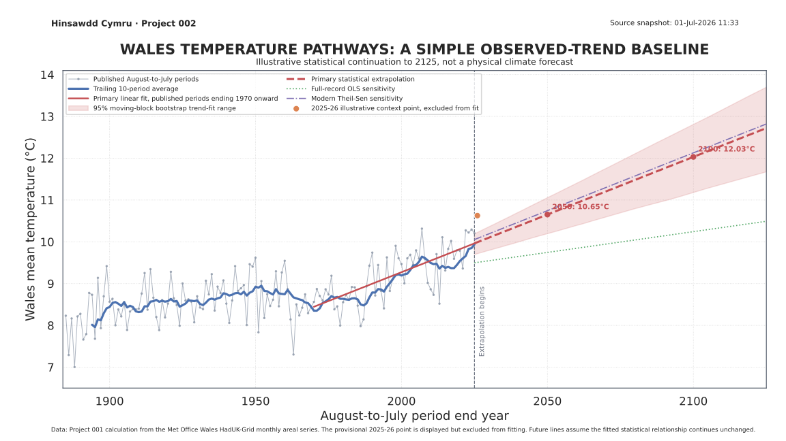

# 002: Llwybrau tymheredd Cymru

## Wales temperature pathways

**Adroddiad canlyniadau / Results report**

Project 002 asks a deliberately narrow question:

> What would a simple continuation of the observed Wales August-to-July temperature trend imply for 2050, 2100 and beyond?

The answer is useful as a transparent baseline, but it must not be confused with a physical climate projection. Linear regression does not know about future greenhouse-gas emissions, climate feedbacks, volcanic eruptions, natural variability or policy choices.

<!-- BEGIN GENERATED RESULT -->
## Headline baseline result

Run `model.py` to generate the verified result block.
<!-- END GENERATED RESULT -->

## Main chart



The chart separates three things:

- published August-to-July observations from Project 001;
- the provisional 2025–26 point, shown for context but excluded from model fitting;
- future straight-line extrapolations and their sensitivity to the chosen historical method.

## Why start with this model?

A simple linear model is intentionally easy to inspect. It establishes a reproducible baseline before Project 002 introduces official UK climate-projection ensembles.

The primary fit uses published-input periods ending in 1970 onward. Two sensitivity lines are also retained:

- ordinary least squares across the full published record;
- a robust Theil-Sen fit across the modern period.

If these approaches diverge substantially in the future, that is evidence that a long-range statistical extrapolation is highly dependent on the selected historical window. It is not evidence that one line is the true future.

## Backtesting

The project runs fixed-origin ten-year hindcasts. For each selected historical cutoff, the model is fitted only to information available up to that point, then assessed against the following ten published periods.

The backtests answer whether the simple model can approximate a later ten-year mean. They do not turn the regression into a physical climate model and should not be interpreted as validation of century-scale forecasts.

## Uncertainty

The shaded range is produced by a deterministic circular moving-block bootstrap of the regression residuals. It is intended to preserve some short-range dependence in the observed series.

It represents uncertainty in the fitted statistical trend under the model assumptions. It does not include the full uncertainty associated with emissions pathways, climate-model structure, regional downscaling or future policy.

## Data boundary

Project 002 consumes the validated outputs of Project 001:

- `projects/001-rolling-temperature/data/derived/august_to_july_mean_temperature.csv`;
- `projects/001-rolling-temperature/data/derived/summary.json`;
- `projects/001-rolling-temperature/data/derived/independent_verification.json`.

Before fitting, it checks continuity, the Project 001 independent-verification result, the primary-summary comparison and the retained Met Office source hash.

The primary fit uses only periods marked `published-inputs`. The current 2025–26 point uses an illustrative July 2026 scenario and is therefore excluded from training.

## Reproduce

From the repository root:

```bash
python projects/001-rolling-temperature/analysis.py
python projects/001-rolling-temperature/verify.py \
  --source projects/001-rolling-temperature/data/raw/metoffice-wales-tmean-source-2026-07-01.txt \
  --manifest projects/001-rolling-temperature/data/raw/metoffice-wales-tmean-source-2026-07-01.provenance.json \
  --primary-summary projects/001-rolling-temperature/data/derived/summary.json \
  --require-annual
python projects/002-temperature-pathways/model.py
python projects/002-temperature-pathways/verify.py
pytest -q projects/002-temperature-pathways/tests
```

## Outputs

- `figures/wales_temperature_pathways_linear_regression.{png,svg}`
- `data/derived/observed_august_to_july_input.csv`
- `data/derived/linear_regression_projection.csv`
- `data/derived/backtest_results.csv`
- `data/derived/model_summary.json`
- `data/derived/independent_verification.json`

## Next stages

The planned next stages are documented in [`PLAN.md`](PLAN.md):

1. audit the newest Welsh, UK, European and global official assessments;
2. aggregate the most suitable UKCP or UKCI ensemble to a Wales area-average;
3. convert official projection data to the same August-to-July boundary;
4. compare observed rolling means with the projection distribution;
5. investigate whether Welsh policy assumptions remain aligned with current evidence.

The current official evidence baseline is summarised in [`OFFICIAL_EVIDENCE_AUDIT.md`](OFFICIAL_EVIDENCE_AUDIT.md).

## Independence

Hinsawdd Cymru is independent. This is a secondary statistical analysis of Met Office-derived Project 001 data, not a forecast or product published or endorsed by the Met Office, Welsh Government, UK Government, Climate Change Committee, European Environment Agency or IPCC.
