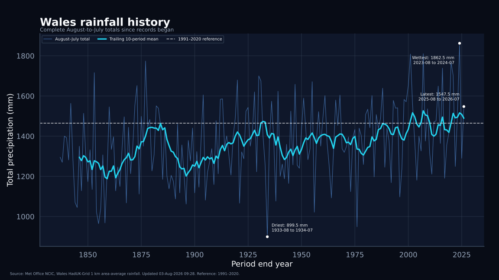
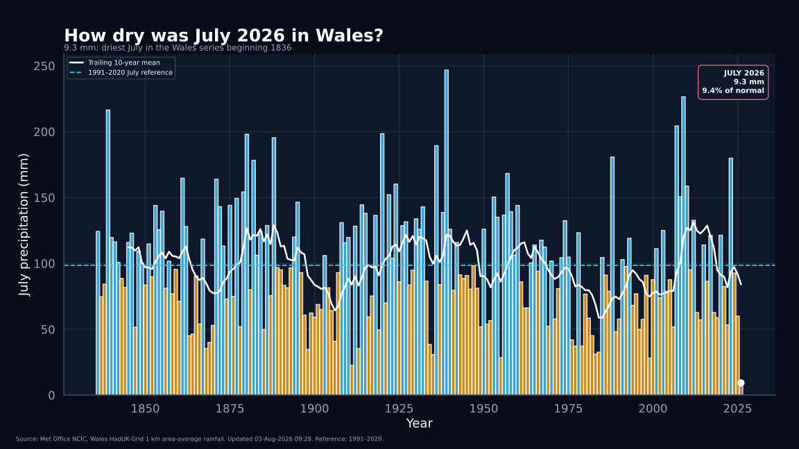
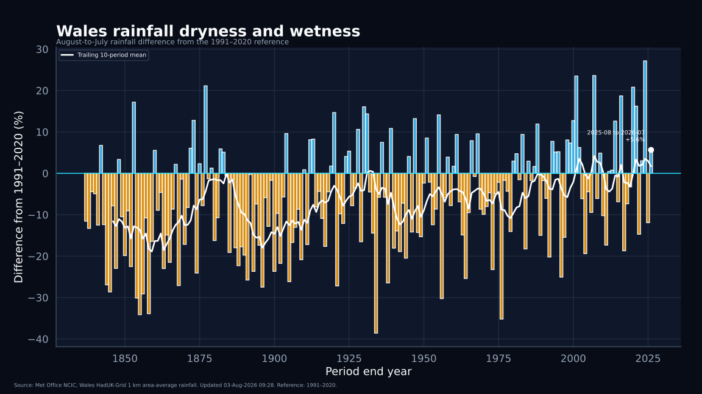
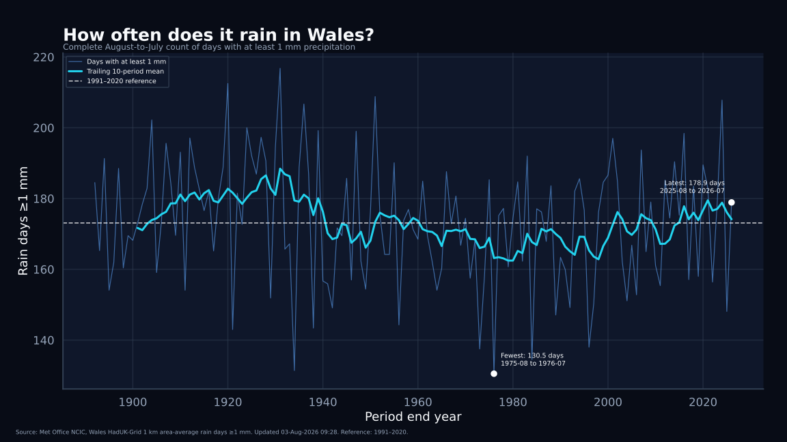
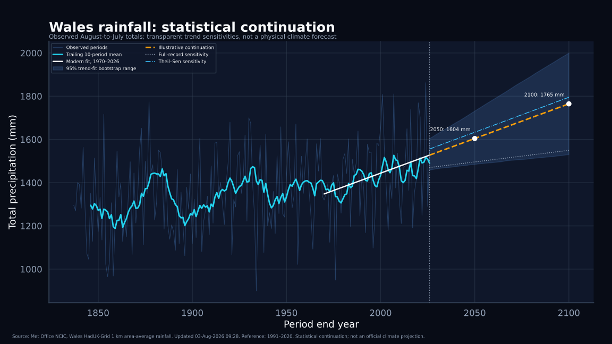

# 003: Glawiad a Sychder Cymru

## Wales rainfall and dryness

**Adroddiad canlyniadau / Results report**

Project 003 now asks four linked but distinct questions:

1. How has Wales-wide rainfall changed since records began?
2. How unusual was the latest dry month?
3. Has the number of rain days changed alongside rainfall totals?
4. What does a deliberately simple statistical continuation produce?

The primary evidence is from official Met Office National Climate Information Centre Wales area-average series derived from HadUK-Grid 1 km observations:

- monthly rainfall totals from 1836;
- monthly counts of days with at least 1 mm precipitation from 1891.

All current public charts use the repository dark theme. Each chart is generated in a 1600 × 900 widescreen version and a 1080 × 1080 square version. Earlier light charts are retained as historical outputs but are no longer the publication default.

<!-- BEGIN GENERATED RESULT -->
## Headline results

| Measure | Result |
|---|---:|
| Official rainfall coverage | **1836-01 to 2026-07** |
| Complete August-to-July periods | **190** |
| 1991–2020 August-to-July reference | **1464.8 mm** |
| Latest complete period | **2025-08 to 2026-07** |
| Latest complete rainfall | **1547.5 mm**, 105.6% of reference |
| July 2026 rainfall | **9.3 mm**, 9.4% of the July reference |
| July 2026 dryness rank | **1 of 191 Julys** |
| Latest rain days ≥1 mm | **178.9 days**, 103.4% of reference |
| Driest complete period | **1933-08 to 1934-07**, 899.5 mm |
| Wettest complete period | **2023-08 to 2024-07**, 1862.5 mm |
| Modern rainfall trend, 1970 onward | **+32.1 mm per decade** |
| Illustrative 2050 continuation | **1604 mm** |
| Illustrative 2100 continuation | **1765 mm** |

July 2026 was the driest July in the Wales series beginning in 1836. That does **not** mean the complete August 2025–July 2026 period was exceptionally dry: its total was slightly above the 1991–2020 August-to-July reference. Monthly dryness, annual rainfall and formal drought status are therefore kept separate.

The continuation values are a transparent statistical baseline, not a physical climate forecast or an official Met Office, UKCP or UKCI projection.
<!-- END GENERATED RESULT -->

## Dark chart suite

### Rainfall history



[Square version](figures/wales_august_to_july_rainfall_history_dark_square.svg)

Every complete August-to-July total is shown with a trailing ten-period mean and the derived 1991–2020 reference.

### How dry was July 2026?



[Square version](figures/wales_july_rainfall_history_dark_square.svg)

This chart compares every July from 1836 to 2026. July 2026 recorded 9.3 mm in the Wales area-average series, 9.4% of the 1991–2020 July reference.

### Annual-scale dryness and wetness



[Square version](figures/wales_august_to_july_rainfall_dryness_dark_square.svg)

The bars show the percentage difference between each complete August-to-July rainfall total and the 1991–2020 reference. Orange means below the reference and blue means above it. This is a rainfall anomaly presentation, not a formal drought index.

### Rain-day frequency



[Square version](figures/wales_august_to_july_raindays_history_dark_square.svg)

This companion measure counts days with at least 1 mm precipitation. It helps distinguish total rainfall from how frequently measurable rain occurs.

### Statistical continuation



[Square version](figures/wales_rainfall_statistical_projection_dark_square.svg)

The chart includes a modern ordinary least-squares fit, a moving-block bootstrap trend-fit range and sensitivity fits. It is deliberately labelled as a statistical continuation rather than a climate forecast.

## What “dryness” means here

There is no single all-purpose Met Office dryness number used by this project. The current observational framework uses complementary measures:

- actual rainfall in millimetres;
- rainfall as a percentage of the 1991–2020 normal;
- rainfall anomaly in percentage points;
- days with at least 1 mm precipitation;
- a clearly specified time window, either one calendar month or a complete August-to-July period.

Formal meteorological, agricultural, hydrological and water-supply drought assessments are not interchangeable. A later drought-index project may add SPI or related indices, but only with the required daily or monthly dataset, accumulation window and validation clearly stated.

## Relative humidity

Mean relative humidity is an official HadUK-Grid variable (`hurs`) beginning in 1961. The current country-level release is distributed through CEDA as NetCDF and requires a registered CEDA account for access.

Humidity is therefore specified as the next separate source-ingestion task in [`HUMIDITY_SOURCE_PLAN.md`](HUMIDITY_SOURCE_PLAN.md). It is not approximated from another provider and is not silently substituted for a drought index.

## Reproduce

From the repository root:

```bash
python projects/003-wales-rainfall/fetch_source.py \
  --output-dir projects/003-wales-rainfall/data/raw

python projects/003-wales-rainfall/fetch_raindays_source.py \
  --output-dir projects/003-wales-rainfall/data/raw

python projects/003-wales-rainfall/dark_climate_charts.py \
  --rainfall-source projects/003-wales-rainfall/data/raw/<rainfall-source>.txt \
  --raindays-source projects/003-wales-rainfall/data/raw/<raindays-source>.txt \
  --output-dir projects/003-wales-rainfall/figures \
  --derived-dir projects/003-wales-rainfall/data/derived \
  --update-readme

python projects/003-wales-rainfall/verify_dark.py \
  --rainfall-source projects/003-wales-rainfall/data/raw/<rainfall-source>.txt \
  --rainfall-manifest projects/003-wales-rainfall/data/raw/<rainfall-source>.provenance.json \
  --raindays-source projects/003-wales-rainfall/data/raw/<raindays-source>.txt \
  --raindays-manifest projects/003-wales-rainfall/data/raw/<raindays-source>.provenance.json
```

## Current outputs

### Derived data

- `data/derived/dark_august_to_july_rainfall.csv`
- `data/derived/july_rainfall_history.csv`
- `data/derived/august_to_july_raindays1mm.csv`
- `data/derived/dark_rainfall_statistical_projection.csv`
- `data/derived/dark_chart_summary.json`
- `data/derived/independent_dark_verification.json`

### Figures

Every stem below has `.png` and `.svg` versions, plus a `_square` pair:

- `wales_august_to_july_rainfall_history_dark`
- `wales_july_rainfall_history_dark`
- `wales_august_to_july_rainfall_dryness_dark`
- `wales_august_to_july_raindays_history_dark`
- `wales_rainfall_statistical_projection_dark`

## Interpretation boundary

This repository analyses Wales-wide area averages. It does not show local rainfall differences, short-duration downpours, river flows, groundwater, soil moisture, crop stress, water-company operational status, flood probability or formal drought severity.

Hinsawdd Cymru is independent. These are reproducible calculations from official Met Office data, not official Met Office products or forecasts.
