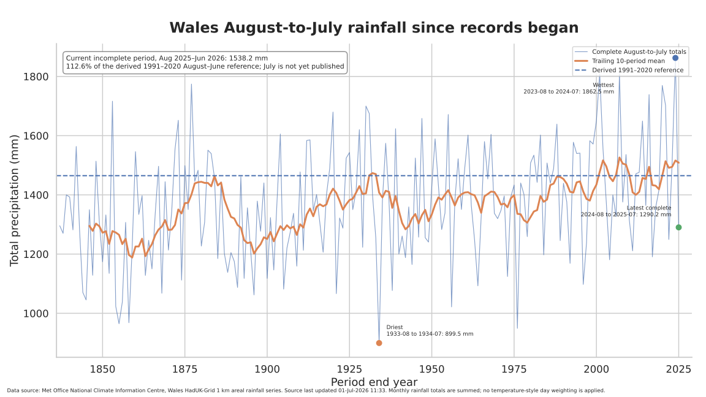
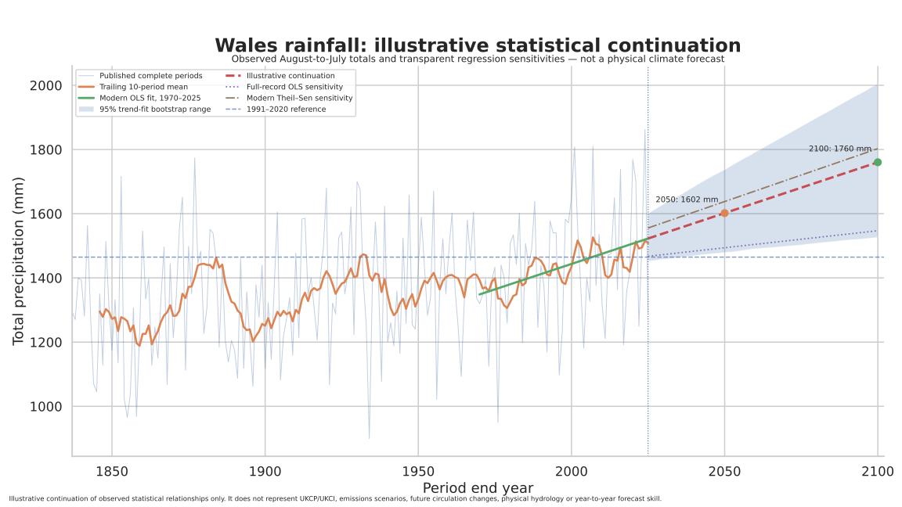

# 003: Glawiad Cymru

## Wales rainfall since 1836

**Adroddiad canlyniadau / Results report**

Project 003 asks:

> How has Wales-wide rainfall changed since records began, what does the latest complete August-to-July period show, and what does a deliberately simple statistical continuation produce?

The primary evidence is the official Met Office National Climate Information Centre Wales areal rainfall series derived from HadUK-Grid 1 km observations. Monthly rainfall totals begin in 1836.

<!-- BEGIN GENERATED RESULT -->
## Headline results

Results are generated by `analysis.py` after the official source has been fetched and independently verified.
<!-- END GENERATED RESULT -->

## Main historical chart



This chart shows every complete August-to-July rainfall total, the trailing ten-period mean and the derived 1991–2020 reference.

The current period beginning in August 2025 is treated separately because the official country series currently contains data only through June 2026. Its August-to-June total is compared only with historical August-to-June periods. It is not ranked against complete twelve-month totals until July is published.

## Statistical projection chart



The projection is deliberately placed after the historical analysis. It includes:

- a modern-period ordinary least-squares fit using complete published periods ending from 1970 onward;
- a full-record regression sensitivity;
- a robust Theil–Sen modern-period sensitivity;
- a moving-block bootstrap range for uncertainty in the fitted statistical trend;
- fixed-origin ten-year backtests.

> **This is not a physical climate forecast.** It does not represent UKCP, UKCI, future emissions, atmospheric circulation, hydrology or flood risk. It is a transparent baseline for later comparison with official climate-projection ensembles.

## Why rainfall first?

Rainfall is the strongest next variable for a long historical Wales analysis because the official monthly HadUK-Grid country series begins in 1836. Humidity and several related variables begin much later, generally from 1961. A scientifically meaningful drought analysis would also require a defined index, such as SPI or SPEI, rather than treating low rainfall alone as drought.

Project 003 therefore remains focused on precipitation totals. Humidity, soil moisture, evapotranspiration and drought indices should be handled as separate, explicitly defined projects.

## Met Office framework adopted

The project follows the official data boundary:

- source variable: total precipitation amount in millimetres;
- source geography: Wales land-area average from the HadUK-Grid 1 km product;
- monthly totals are summed, not averaged;
- annual reconstructed totals are reconciled against the official annual column;
- the 1991–2020 comparison is expressed in millimetres and as a percentage of the reference;
- provisional or incomplete periods are kept separate from complete published periods;
- the exact source bytes, retrieval metadata and SHA-256 digest are retained.

Official background:

- https://www.metoffice.gov.uk/research/climate/maps-and-data/data/haduk-grid/haduk-grid
- https://www.metoffice.gov.uk/research/climate/maps-and-data/data/haduk-grid/datasets
- https://www.metoffice.gov.uk/research/climate/maps-and-data/about/archives
- https://www.metoffice.gov.uk/pub/data/weather/uk/climate/datasets/Rainfall/date/Wales.txt

## Reproduce

From the repository root:

```bash
python projects/003-wales-rainfall/fetch_source.py \
  --output-dir projects/003-wales-rainfall/data/raw

python projects/003-wales-rainfall/analysis.py \
  --source projects/003-wales-rainfall/data/raw/<retrieved-source>.txt

python projects/003-wales-rainfall/verify.py \
  --source projects/003-wales-rainfall/data/raw/<retrieved-source>.txt \
  --manifest projects/003-wales-rainfall/data/raw/<retrieved-source>.provenance.json
```

## Outputs

### Data

- `data/derived/wales_monthly_rainfall.csv`
- `data/derived/wales_official_annual_and_seasonal_rainfall.csv`
- `data/derived/annual_reconciliation.csv`
- `data/derived/august_to_july_rainfall.csv`
- `data/derived/august_to_june_rainfall.csv`
- `data/derived/seasonal_trends.csv`
- `data/derived/rainfall_statistical_projection.csv`
- `data/derived/backtest_results.csv`
- `data/derived/summary.json`
- `data/derived/independent_verification.json`

### Figures

- `figures/wales_august_to_july_rainfall_history.{png,svg}`
- `figures/wales_rainfall_statistical_projection.{png,svg}`

## Interpretation boundary

This repository analyses a Wales-wide area average. It does not show local rainfall differences, short-duration downpours, river flows, groundwater, soil moisture, flood probability or drought severity. Those require different spatial and physical datasets.

Hinsawdd Cymru is independent. These are reproducible calculations from Met Office data, not official Met Office products or forecasts.
