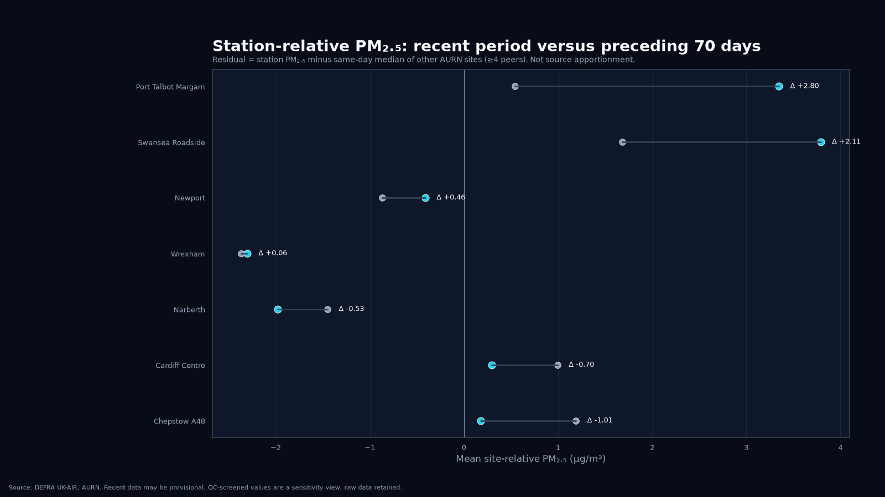
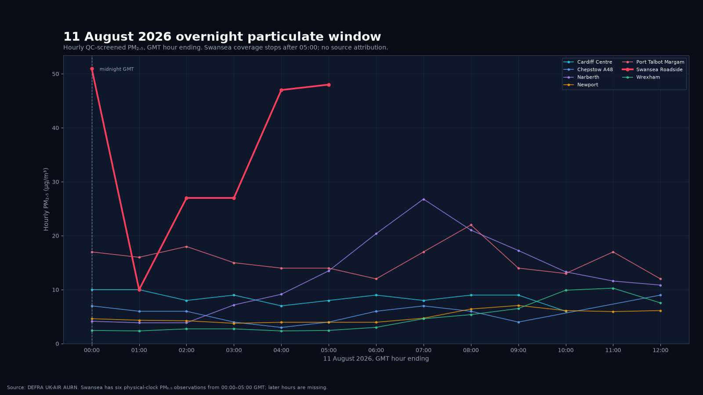

# Project 005 — Wales air quality baseline

## Question

What have measured air-pollution concentrations across Wales looked like over the latest year, and does the recent exceptionally dry period show any unusual particulate pattern worth investigating further?

Project 005 begins with observations. It does **not** assume that wildfires, traffic, industry or any other source caused a measured peak.

## Stage A — reference-grade PM2.5 baseline

The first stage uses the Welsh sites in the UK Automatic Urban and Rural Network (AURN) retained as currently measuring hourly PM2.5. AURN annual CSV files are downloaded directly from DEFRA UK-AIR, with exact source bytes and SHA-256 provenance retained for reproducibility.

| Site | Code | Type |
|---|---:|---|
| Cardiff Centre | CARD | Urban Background |
| Chepstow A48 | CHP | Urban Traffic |
| Narberth | PEMB | Rural Background |
| Newport | NPT3 | Urban Background |
| Port Talbot Margam | PT4 | Urban Industrial |
| Swansea Roadside | SWA1 | Urban Traffic |
| Wrexham | WREX | Urban Traffic |

Site type remains explicit throughout the analysis. A roadside value is not silently treated as equivalent to a rural-background value and the network is not collapsed into an unweighted “Wales mean”.

## Current validated baseline

The latest retained official snapshot includes **11 August 2026**. The rolling baseline is **12 August 2025 to 11 August 2026** and the current 70-day window is **3 June to 11 August 2026**, compared with the immediately preceding 70 days.

The table uses the QC-screened sensitivity series described below; raw measurements remain retained.

| Site | Rolling-year mean PM2.5 | Valid days | Previous 70-day mean | Recent 70-day mean | Change |
|---|---:|---:|---:|---:|---:|
| Cardiff Centre | 7.82 µg/m³ | 344/365 | 8.24 | 7.03 | -14.6% |
| Chepstow A48 | 8.05 µg/m³ | 355/365 | 8.45 | 6.79 | -19.7% |
| Narberth | 5.65 µg/m³ | 347/365 | 6.22 | 5.20 | -16.5% |
| Newport | 6.74 µg/m³ | 365/365 | 6.80 | 6.68 | -1.7% |
| Port Talbot Margam | 7.49 µg/m³ | 345/365 | 7.91 | 9.99 | **+26.3%** |
| Swansea Roadside | 8.33 µg/m³ | 291/365 | 8.91 | 10.03 | **+12.6%** |
| Wrexham | 5.86 µg/m³ | 359/365 | 5.36 | 4.98 | -7.1% |

The observational result remains **not a Wales-wide deterioration**. The recent period is higher at Port Talbot Margam and Swansea Roadside, broadly stable at Newport, and lower at the other four reference sites.

## QC sensitivity: preserve raw data, flag before attribution

The retained Swansea file contains a provisional **430 µg/m³ PM2.5** value at 01:00 on 14 July while collocated PM10 is only **16.425 µg/m³**. Project 005 does not delete it. Instead it creates a parallel `pm25_screened` sensitivity series that flags a value only when it is provisional, PM2.5 is at least 100 µg/m³, collocated PM10 is present, and PM2.5 is more than twice PM10.

That rule currently flags **one observation**. Swansea's recent-window change is **+12.6%** in the screened sensitivity series versus **+15.7%** in the raw series. This makes the influence of the provisional excursion visible rather than hiding it.

Coherent high-particulate events in which PM2.5 and PM10 rise together are retained untouched.

## Regional versus site-specific change

Project 005 also compares each station with the same-day median PM2.5 at the other reporting AURN sites, requiring at least four peers. The derived residual is observational context, **not source apportionment**.

In the latest 70-day window:

- **Swansea Roadside** shifts from a mean site-relative excess of **+1.68 to +3.79 µg/m³**, a change of **+2.11 µg/m³**. It continues to track the wider network strongly, while its PM2.5–NO2 correlation is higher in the recent period.
- **Port Talbot Margam** shifts from **+0.54 to +3.35 µg/m³**, a change of **+2.80 µg/m³**, while also remaining strongly correlated with wider-network variability.

The current evidence is therefore consistent with **common regional variability plus an additional local/site-specific component** at both sites. It does not identify the source of either component.

## 11 August overnight particulate event

The official files now contain the episode that was missing from the first snapshot.

Swansea Roadside has only five observations assigned to the 11 August AURN reporting day, so the daily baseline correctly refuses to publish a Swansea daily mean. For event analysis, however, AURN's `10 August 24:00` record is physically midnight on 11 August. Together with the next five records, this gives six physical-clock Swansea observations from **00:00–05:00 GMT**.

Across those six hours:

- mean PM2.5: **35.0 µg/m³**;
- maximum: **51.0 µg/m³** at midnight GMT;
- prior-365-day Swansea hourly PM2.5 p95: **20.0 µg/m³**;
- **5 of 6** observed hours were at or above that threshold;
- mean PM10: **37.84 µg/m³**;
- mean NO2: **9.02 µg/m³**;
- mean PM2.5/PM10 ratio: approximately **0.88**.

The simultaneous PM2.5/PM10 rise with relatively modest NO2 is a credible particulate episode and is not well described as a simple traffic-only spike. **It is not, by itself, proof that the Blaenavon fire caused the episode.** Swansea coverage stops after 05:00.

The same physical-clock day is also elevated at Port Talbot Margam (mean PM2.5 **13.96**, 6 hours at/above its prior-year p95) and Narberth (**10.02**, 4 hours at/above its p95), while Cardiff, Newport, Wrexham and Chepstow remain lower. This spatial pattern is useful for the next wind/satellite attribution stage.

[Read the event-study register](EVENT_STUDY.md) for the July controls, 11 August hourly evidence and attribution rules.

## Visual summary

The recent-period chart keeps every station visible rather than collapsing the network into a single national average.

<a href="figures/wales_aurn_pm25_recent_dark.png"></a>

The within-station comparison shows the divergent recent change at Swansea and Port Talbot.

<a href="figures/wales_aurn_pm25_recent_vs_previous_dark.png"></a>

The site-relative view separates shared network movement from each station's excess relative to its peers.

<a href="figures/wales_aurn_pm25_site_relative_change_dark.png"></a>

The dedicated 11 August chart uses physical GMT hour-ending time and makes Swansea's incomplete later coverage explicit.

<a href="figures/wales_aurn_pm25_aug11_smoke_window_dark.png"></a>

## Outputs

`analysis.py` builds the baseline, QC and event-screen evidence:

- retained raw annual source files plus provenance;
- combined hourly observations during a run;
- raw and QC-screened daily means with a minimum 18-hour completeness rule;
- rolling 365-day and recent 70-day PM2.5 datasets;
- recent-versus-previous station comparisons;
- QC warning table;
- same-day site-relative PM2.5 residuals and summaries;
- recent network event screen and coherent hourly July candidates;
- machine-readable run summary.

`aug11_event.py` consumes the validated hourly baseline output and produces:

- `pm25_aug11_hourly.csv`;
- `pm25_aug11_event_summary.csv`;
- the dedicated 11 August hourly chart in wide and square PNG/SVG forms.

The full dark chart suite now contains eight families:

1. `wales_aurn_pm25_rolling_year_dark`
2. `wales_aurn_pm25_recent_dark`
3. `wales_aurn_pm25_station_distribution_dark`
4. `wales_aurn_pm25_recent_vs_previous_dark`
5. `wales_aurn_pm25_site_relative_change_dark`
6. `wales_aurn_pm25_july_event_screen_dark`
7. `wales_aurn_pm25_aug11_smoke_window_dark`
8. `wales_aurn_pm25_station_map_dark`

Each is generated as 1600×900 and 1080×1080 PNG/SVG under the repository-wide [dark publication standard](../../VISUAL_STYLE.md).

## Interpretation boundary

This project distinguishes **measurement**, **quality-control sensitivity**, **event screening** and **attribution**.

A wildfire attribution requires several independent layers to agree: a credible ground event, overlapping fire timing, wind/dispersion evidence, satellite/fire evidence where available, and consideration of alternative explanations such as traffic, industry, dust or wider regional aerosol.

A smoke plume seen from satellite is not itself a ground-level concentration measurement, and a coincident PM2.5 rise is not by itself proof of wildfire causation.

## Broader Welsh network and meteorology

Air Quality in Wales publishes additional automatic local-authority monitoring data. That broader network remains a later ingestion stage so heterogeneous sites are added with explicit network and environment metadata.

For attribution, Air Quality in Wales also exposes site-linked modelled winds at Swansea and measured/modelled winds at Port Talbot Margam. Those products will be added with their documented spatial-resolution limitations rather than substituted with consumer weather feeds.

## Data status

Recent AURN observations can be provisional and may later be verified, ratified or revised. Project 005 retains source provenance and reports the upstream status rather than presenting recent values as final ratified statistics.

## Reproduce

```bash
python -m venv .venv
source .venv/bin/activate
pip install -e ".[dev]"

python projects/005-wales-air-quality/analysis.py
python projects/005-wales-air-quality/aug11_event.py
pytest -q projects/005-wales-air-quality/tests
```

The baseline can also be re-analysed from already retained source files with `analysis.py --use-retained`.

## Next stages

- **Stage A:** reference-grade AURN PM2.5 baseline — implemented.
- **Stage B:** broader Air Quality in Wales automatic network with explicit metadata.
- **Stage C:** systematic PM10, NO2 and ozone comparative views.
- **Stage D:** event screening — underway, with July controls and the 11 August hourly case retained.
- **Stage E:** wind, satellite and atmospheric-dispersion attribution, kept separate from the raw observational result.

PFAS/“forever chemical” site proximity remains outside Project 005's air-quality attribution scope and is better treated as a separate environmental-exposure project.
