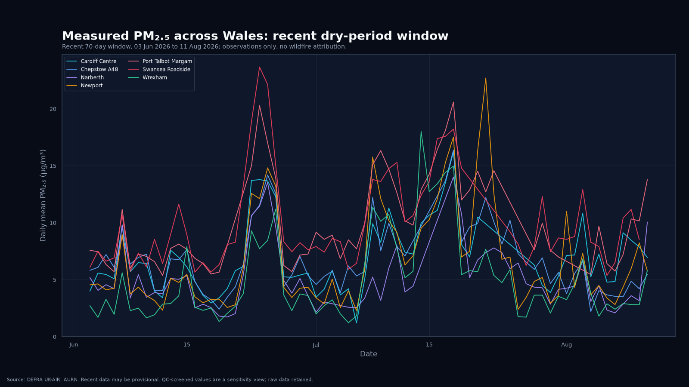
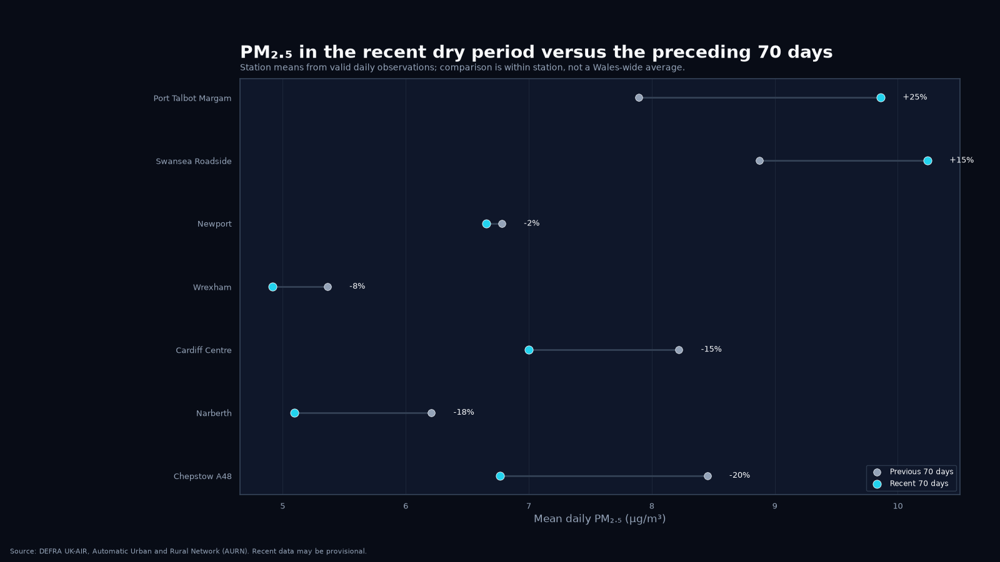

# Project 005 — Wales air quality baseline

## Question

What have measured air-pollution concentrations across Wales looked like over the latest year, and does the recent exceptionally dry period show any unusual particulate pattern worth investigating further?

Project 005 begins with observations. It does **not** assume that wildfires, traffic, industry or any other source caused a measured peak.

## Stage A — reference-grade PM2.5 baseline

The first stage uses the Welsh sites in the UK Automatic Urban and Rural Network (AURN) that currently measure hourly PM2.5. AURN is the UK reference-grade automatic monitoring network, and its pre-formatted annual CSV files are published by DEFRA UK-AIR and updated daily.

The retained Stage A station set is:

| Site | Code | Type |
|---|---:|---|
| Cardiff Centre | CARD | Urban Background |
| Chepstow A48 | CHP | Urban Traffic |
| Narberth | PEMB | Rural Background |
| Newport | NPT3 | Urban Background |
| Port Talbot Margam | PT4 | Urban Industrial |
| Swansea Roadside | SWA1 | Urban Traffic |
| Wrexham | WREX | Urban Traffic |

Site type remains explicit throughout the analysis. A roadside value is not silently treated as equivalent to a rural-background value.

## First live baseline

The first validated live run downloaded the 2025 and 2026 official AURN files for all seven stations. The latest reporting day present in that snapshot was **10 August 2026**, giving a rolling baseline from **11 August 2025 to 10 August 2026** and a recent 70-day window from **2 June to 10 August 2026**.

| Site | Rolling-year mean PM2.5 | Valid rolling-year days | Previous 70-day mean | Recent 70-day mean | Change |
|---|---:|---:|---:|---:|---:|
| Cardiff Centre | 7.84 µg/m³ | 343/365 | 8.22 | 7.00 | -14.9% |
| Chepstow A48 | 8.09 µg/m³ | 355/365 | 8.45 | 6.77 | -19.9% |
| Narberth | 5.66 µg/m³ | 347/365 | 6.21 | 5.10 | -17.9% |
| Newport | 6.76 µg/m³ | 365/365 | 6.78 | 6.66 | -1.8% |
| Port Talbot Margam | 7.48 µg/m³ | 345/365 | 7.90 | 9.86 | **+24.9%** |
| Swansea Roadside | 8.42 µg/m³ | 292/365 | 8.87 | 10.24 | **+15.4%** |
| Wrexham | 5.86 µg/m³ | 359/365 | 5.36 | 4.92 | -8.3% |

The first observational result is therefore **not a Wales-wide deterioration**. In this seven-site reference network, the recent period is higher at Port Talbot Margam and Swansea Roadside, almost unchanged at Newport, and lower at the other four stations. Because Swansea is an urban-traffic site and Port Talbot Margam is urban-industrial, this pattern cannot be treated as evidence of wildfire pollution without further work.

The recent window also contains short-lived particulate episodes. The highest valid recent daily PM2.5 mean in this snapshot is **30.57 µg/m³ at Swansea Roadside on 14 July 2026**. The time-series charts retain these peaks for later event-by-event investigation rather than assigning a cause here.

The **11 August Blaenavon fire/smoke episode is not yet represented in this snapshot**, because the annual AURN files available to this run ended on 10 August. It is therefore a later event-study target, not part of the baseline result above.

## Visual summary

The recent-period chart keeps every station visible rather than collapsing the network into a single national mean.

<a href="figures/wales_aurn_pm25_recent_dark.png"></a>

The within-station comparison makes the initial result easier to see: Port Talbot Margam and Swansea Roadside rise during the recent 70 days while most other reference sites fall or remain broadly stable.

<a href="figures/wales_aurn_pm25_recent_vs_previous_dark.png"></a>

## Initial outputs

Running `analysis.py` downloads the current and previous calendar-year AURN files for each station, retains the exact source bytes and SHA-256 provenance records, and builds:

- combined hourly observations;
- daily means requiring at least 18 valid hourly values for a station-day;
- a latest rolling 365-day PM2.5 dataset;
- a latest 70-day PM2.5 dataset for the recent dry-period view;
- a within-station comparison of the recent 70 days with the immediately preceding 70 days;
- station-level coverage, mean, median, 95th percentile and maximum summaries;
- a machine-readable run summary.

It then produces the dark-mode chart suite in both 1600×900 and 1080×1080 PNG/SVG forms:

1. `wales_aurn_pm25_rolling_year_dark`
2. `wales_aurn_pm25_recent_dark`
3. `wales_aurn_pm25_station_distribution_dark`
4. `wales_aurn_pm25_recent_vs_previous_dark`
5. `wales_aurn_pm25_station_map_dark`

The visual system follows the repository-wide [dark-mode publication standard](../../VISUAL_STYLE.md).

## Interpretation boundary

This stage answers **what was measured**, not **why it happened**.

A later wildfire case study may combine:

- anomalous PM2.5 observations;
- fire timing and location;
- wind speed and direction;
- NASA satellite smoke/fire observations;
- atmospheric transport or dispersion products.

Those layers will be introduced only after the observational baseline is established. A smoke plume seen from satellite is not itself a ground-level air-quality measurement, and a coincident PM2.5 rise is not by itself proof of wildfire attribution.

## Broader Welsh network

Air Quality in Wales publishes additional automatic local-authority monitoring data, including hourly pollutant concentrations. That broader network is reserved for Stage B so that the first national picture has a clear, quality-controlled AURN baseline before heterogeneous local sites are added.

## Data status

Recent AURN observations can be provisional. The Welsh Air Quality Database explains that near-real-time AURN values are uploaded hourly after basic automated screening and are subsequently subject to verification and ratification. Project 005 therefore retains source provenance and avoids presenting recent values as final ratified statistics.

## Reproduce

```bash
python -m venv .venv
source .venv/bin/activate
pip install -e ".[dev]"

python projects/005-wales-air-quality/analysis.py
pytest -q projects/005-wales-air-quality/tests
```

Optional windows:

```bash
python projects/005-wales-air-quality/analysis.py \
  --rolling-days 365 \
  --recent-days 70
```

## Next stages

- **Stage A:** AURN PM2.5 observational baseline and chart suite.
- **Stage B:** add the broader Air Quality in Wales automatic network with explicit network/site-type metadata.
- **Stage C:** add PM10, NO2 and ozone comparative views.
- **Stage D:** investigate individual high-particulate episodes, beginning with recent summer 2026 fire/smoke episodes if the measured data justify it.
- **Stage E:** meteorology, satellite and atmospheric-dispersion attribution, kept separate from the raw observational result.

PFAS/“forever chemical” site proximity is outside Project 005's initial scope. It may justify a separate environmental-exposure project rather than being folded into air-quality attribution without evidence.
