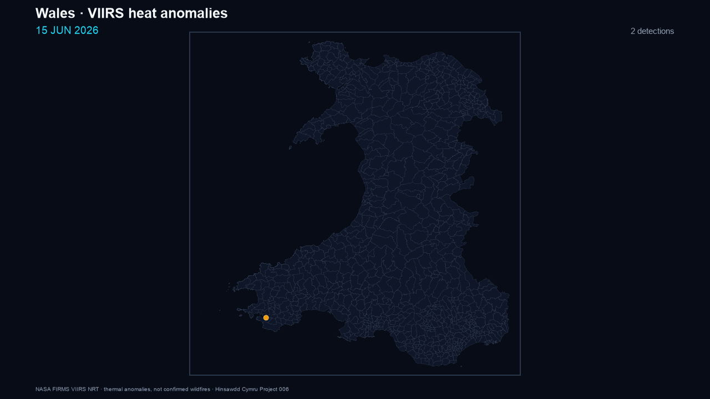

# Project 006 — Wales Wildfire Watch

## Publication status

**Seasonal hold (Autumn 2026)** — published provisional research output; day-to-day operator watching is paused while Wales fire season eases. Refresh manually via GitHub Actions `workflow_dispatch` or `run_all.py` if needed. No watchers.

Project 006 is a reproducible research and situational-awareness workflow built from public NASA FIRMS VIIRS observations. A satellite thermal anomaly is not automatically a wildfire, so the project keeps the raw observation, derived cluster, satellite-evidence category and independent external corroboration separate.

**For the current operator readout and autumn hold note, see [CURRENT_SITUATION.md](CURRENT_SITUATION.md).**

<!-- PROJECT006_STATUS_START -->
> ✅ **Latest refresh succeeded.**  
> Latest successful data snapshot: **02 September 2026 14:28 UTC**.  
> Latest satellite observation in that snapshot: **02 September 2026 04:00 UTC**.  
> Published Wales-window detections: **8**. Derived candidate clusters inside the official Wales boundary: **2**.  
> Latest refresh attempt: **02 September 2026 14:32 UTC**.  
> Date-stamped map stem for this successful snapshot: `2026-09-02_1428UTC`.
<!-- PROJECT006_STATUS_END -->

## Latest published maps

These graphics are generated programmatically from the published data with Python, pandas, Matplotlib and Seaborn. They are not generative-image outputs.

**Current map shown below:** data snapshot **21 August 2026 16:34 UTC**; latest satellite observation **21 August 2026 13:12 UTC**.

<a href="published/figures/wales_wildfire_watch_dark.png"></a>

<p align="center"><a href="published/figures/wales_wildfire_watch_dark_square.png"></a></p>

The current published two-day snapshot contains **19 VIIRS detections in the Wales watch window** and **4 derived candidate clusters inside the official Wales boundary**. The latest observation is **21 August 2026 at 13:12 UTC**. These are thermal anomalies, not a confirmed wildfire count.

Top ranked cluster this refresh: **Glascwm** (7 detections, multi-satellite, peak FRP ~5.6 MW, evidence band *plausible*). Swansea/Gower 24h watch: **0** detections. See [CURRENT_SITUATION.md](CURRENT_SITUATION.md).

PNG maps carry a prominent UTC banner showing both the **data snapshot time** and the **latest observation time**, with a date-stamped copy beside the stable `latest` filename.

### Heat-anomaly history animation

Day-by-day playback of **all** Wales-watch VIIRS thermal anomalies in the cumulative history (15 June 2026 onward), dark Wales basemap, **4 fps**, no legend. Thermal anomalies are **not** confirmed wildfires.

<a href="published/figures/wales_heat_anomalies_history_dark.gif"></a>

<p align="center"><a href="published/figures/wales_heat_anomalies_history_dark.html">Open HTML preview</a> · rebuild with <code>python history_gif.py --fps 4</code></p>

## Data pipeline

**NASA FIRMS VIIRS → retained source data and provenance → normalised detections → 5 km / 18 hour clustering → official Welsh Government boundary → candidate locations → satellite evidence → external corroboration → published maps and CSV/GeoJSON evidence**

The three feeds are `VIIRS_SNPP_NRT`, `VIIRS_NOAA20_NRT` and `VIIRS_NOAA21_NRT`. NASA's nominal 375 m VIIRS pixel size is a product resolution, not a GPS-accuracy claim. Global FIRMS NRT for Wales is typically available within about **1–3 hours** of observation (best effort); US/Canada ultra-real-time direct readout is not this path.

The official location label comes from the Welsh Government DataMapWales **Communities (Wales)** boundary. Each published candidate also receives direct OpenStreetMap and Google Maps links to its retained cluster centroid.

## Local operator tooling

| Script | Role |
|---|---|
| `firms_ping.py` | Minute poll until UK/Gower latest obs moves; optional `--run-all --open` |
| `watch_and_alert.py` | Long watch (e.g. 6h); on refresh runs `run_all`, writes `ALERTS/`, commits and pushes to GitHub |
| `pass_calendar.py` | VIIRS overpass calendar for Wales/Gower (TLE culminations) |
| `waiting_room.py` | Dark local status page tying FIRMS lag to passes |
| `run_all.py` | Situational full refresh (publication + local Gower/wales-now) |
| `local_watch.py` | Swansea–Gower rolling window |
| `history_gif.py` | Dark 4 fps GIF of cumulative Wales-watch heat anomalies |

Figure registry: [FIGURES.md](FIGURES.md). VIIRS browse products: [VIIRS_PRODUCTS.md](VIIRS_PRODUCTS.md).

## Historical record

The first automated publication run completed a **60-day backfill**. The cumulative record continues under `data/history/` (`detections.csv`, `daily_summary.csv`, provenance and raw source responses). See [HISTORY.md](HISTORY.md). The published history GIF above is built from that table.

## Publication workflow (manual in autumn)

The GitHub Actions workflow [`project-006-daily.yml`](../../.github/workflows/project-006-daily.yml) is **manual-only** during the Autumn 2026 hold (`workflow_dispatch`; no cron). It retrieves the latest FIRMS data, rebuilds the scientific map, adds location links, runs external corroboration, appends new observations to the cumulative history and commits changed public outputs back to `main`.

Publication status is explicit: a successful run updates the published data, README status and date-stamped maps; a failed run records the failed attempt in the README while retaining the previous successful publication rather than presenting a partial refresh as current.

## Evidence interpretation

- **strong satellite evidence** — repeated and persistent multi-satellite evidence meeting the documented thresholds;
- **plausible** — a real thermal signal with supporting repetition, multiple satellites or stronger intensity;
- **low** — weak or isolated satellite evidence.

External reports remain a separate evidence layer. A recent known fire near a cluster does not prove the current satellite signal is the same event, and absence of a public report is not evidence that no fire exists.

## Reproduce and validate

```bash
python -m venv .venv
source .venv/bin/activate
pip install -e ".[dev]"
pytest -q projects/006-wildfire-watch/tests
```

A live run additionally requires `NASA_FIRMS_MAP_KEY`. Pass calendar / waiting room also need `skyfield` (and network access for CelesTrak weather TLEs).

## Next stages

Next work includes friendlier nearest-settlement labels, recurrence/static-heat screening, vegetation context, and later reconciliation of NRT history against NASA Standard Processing.

See [METHODOLOGY.md](METHODOLOGY.md), [SOURCES.md](SOURCES.md), [CORRELATIONS.md](CORRELATIONS.md) and [HISTORY.md](HISTORY.md) for the full contracts and caveats.
