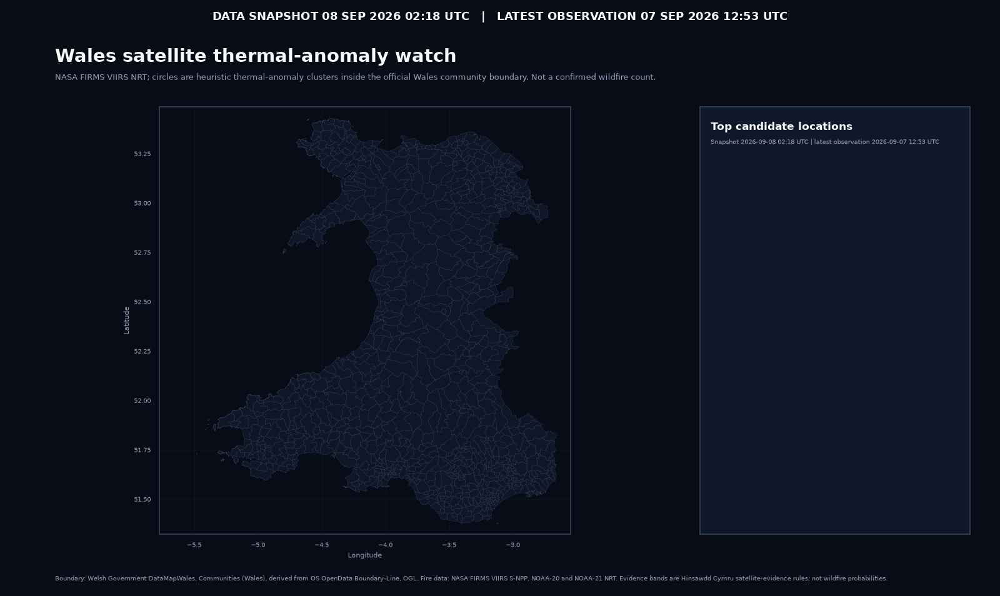
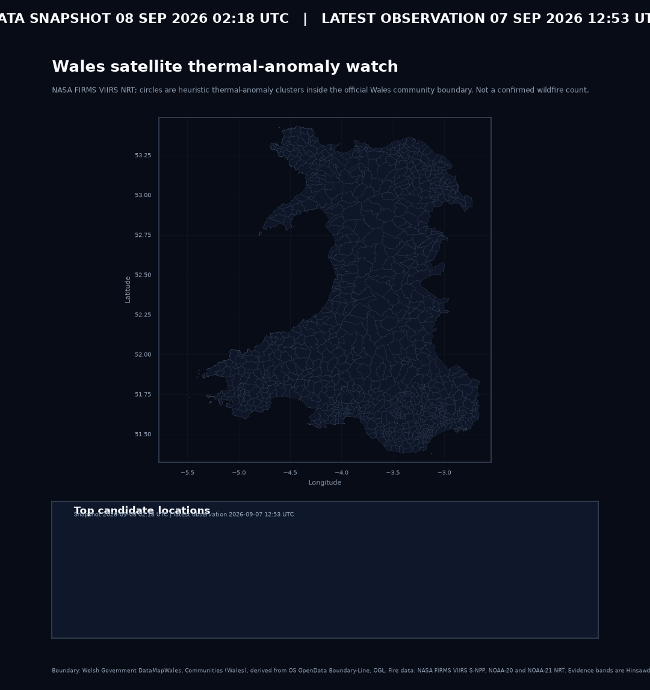

# Project 006 — Wales Wildfire Watch

## Publication status

**Published first public release — provisional research output.**

Project 006 is a reproducible research and situational-awareness workflow built from public NASA FIRMS VIIRS observations. A satellite thermal anomaly is not automatically a wildfire, so the project keeps the raw observation, derived cluster, satellite-evidence category and independent external corroboration separate.

<!-- PROJECT006_STATUS_START -->
> ⚠️ **Latest refresh failed; the previous successful publication is retained.**  
> Latest successful data snapshot: **14 August 2026 02:02 UTC**.  
> Latest satellite observation in that snapshot: **13 August 2026 14:22 UTC**.  
> Published Wales-window detections: **791**. Derived candidate clusters inside the official Wales boundary: **17**.  
> Latest refresh attempt: **14 August 2026 11:11 UTC**, failed before publication because the live NASA FIRMS `VIIRS_SNPP_NRT` request returned a connection error.  
> Future successful publications will also write date-stamped map files using the snapshot time, for example `2026-08-14_0202UTC`.
<!-- PROJECT006_STATUS_END -->

## Latest published maps

These graphics are generated programmatically from the published data with Python, pandas, Matplotlib and Seaborn. They are not generative-image outputs.

**Current map shown below:** data snapshot **14 August 2026 02:02 UTC**; latest satellite observation **13 August 2026 14:22 UTC**. The newest attempted refresh failed, so these maps have deliberately not been replaced with partial data.

<a href="published/figures/wales_wildfire_watch_dark.png"></a>

<p align="center"><a href="published/figures/wales_wildfire_watch_dark_square.png"></a></p>

The current published two-day snapshot contains **791 VIIRS detections in the Wales watch window** and **17 derived candidate clusters inside the official Wales boundary**. The latest observation is **13 August 2026 at 14:22 UTC**. These are thermal anomalies, not a confirmed wildfire count.

From the next successful publication onward, PNG maps will carry a prominent UTC banner showing both the **data snapshot time** and the **latest observation time**, and a date-stamped copy will be written alongside the stable `latest` filename. This keeps README links stable while making downloaded/shared images self-dating.

## Data pipeline

**NASA FIRMS VIIRS → retained source data and provenance → normalised detections → 5 km / 18 hour clustering → official Welsh Government boundary → candidate locations → satellite evidence → external corroboration → published maps and CSV/GeoJSON evidence**

The three feeds are `VIIRS_SNPP_NRT`, `VIIRS_NOAA20_NRT` and `VIIRS_NOAA21_NRT`. NASA's nominal 375 m VIIRS pixel size is a product resolution, not a GPS-accuracy claim.

The official location label comes from the Welsh Government DataMapWales **Communities (Wales)** boundary. Each published candidate also receives direct OpenStreetMap and Google Maps links to its retained cluster centroid.

## Historical record

The first automated publication run completed a **60-day backfill**. The cumulative record currently contains **3,177 normalized observations from 15 June to 13 August 2026**.

Historical outputs are retained under `data/history/`, including `detections.csv`, `daily_summary.csv`, provenance and raw source responses. See [HISTORY.md](HISTORY.md).

## Daily publication

A GitHub Actions workflow runs daily and can also be triggered manually. It retrieves the latest FIRMS data, rebuilds the scientific map, adds location links, runs external corroboration, appends new observations to the cumulative history and commits changed public outputs back to `main`.

Publication status is now explicit: a successful run updates the published data, README status and date-stamped maps; a failed run records the failed attempt in the README while retaining the previous successful publication rather than presenting a partial refresh as current.

## Evidence interpretation

- **strong satellite evidence** — repeated and persistent multi-satellite evidence meeting the documented thresholds;
- **plausible** — a real thermal signal with supporting repetition, multiple satellites or stronger intensity;
- **low** — weak or isolated satellite evidence.

External reports remain a separate evidence layer. A recent known fire near a cluster does not prove the current satellite signal is the same event, and absence of a public report is not evidence that no fire exists.

## Reproduce and validate

```bash
python -m venv .venv
source .venv/bin/activate
pip install -e ".[dev]"
pytest -q projects/006-wildfire-watch/tests
```

A live run additionally requires `NASA_FIRMS_MAP_KEY`.

## Next stages

Next work includes friendlier nearest-settlement labels, recurrence/static-heat screening, vegetation context, a time-series/playback view, and later reconciliation of NRT history against NASA Standard Processing.

See [METHODOLOGY.md](METHODOLOGY.md), [SOURCES.md](SOURCES.md) and [HISTORY.md](HISTORY.md) for the full contracts and caveats.
