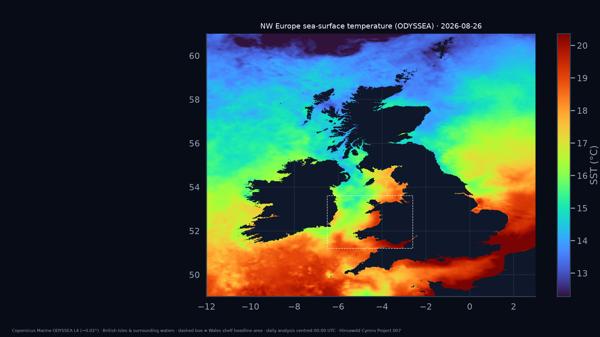
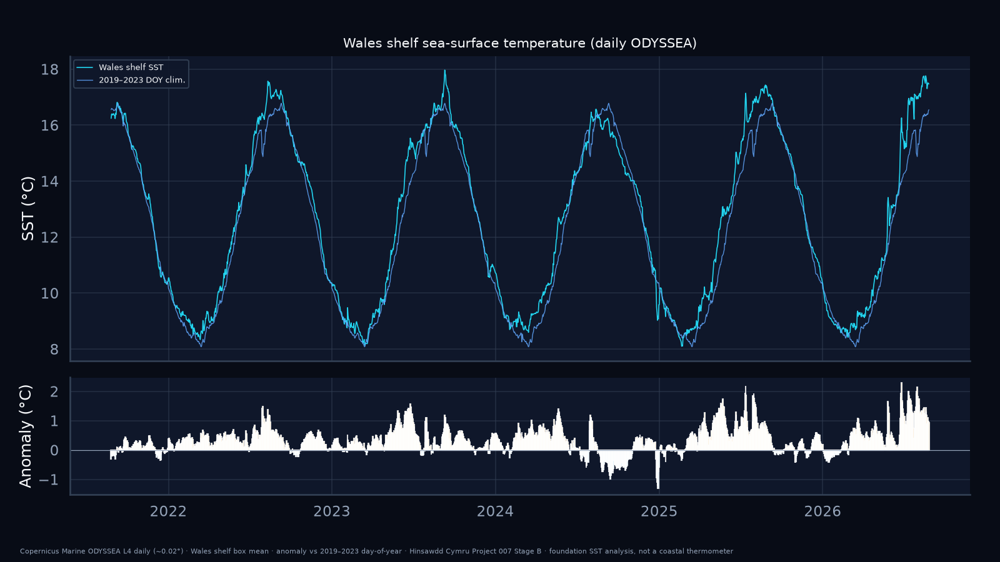
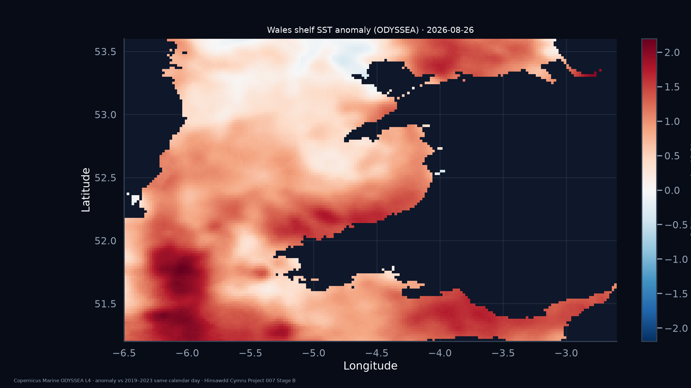
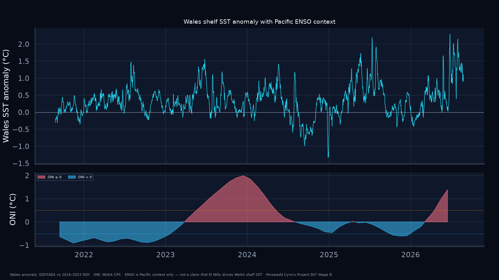
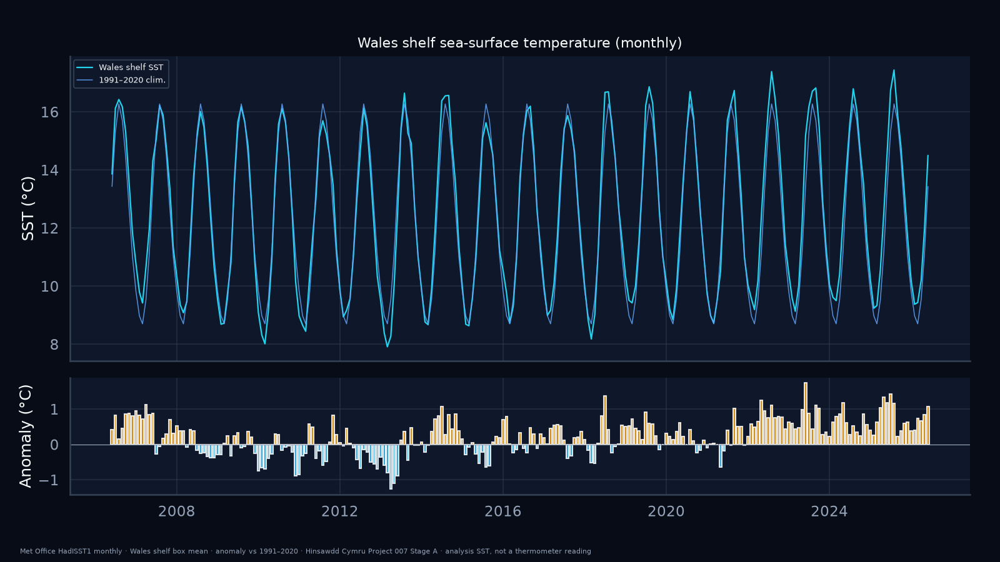

# Project 007 — Wales coastal sea-surface temperature

## Publication status

**Stage B published** — Copernicus Marine **ODYSSEA** daily (~0.02°) NW Europe snapshot maps + Wales-shelf time series, alongside Stage A HadISST monthly climate baseline.

**Browse the snapshot:** [`published/snapshot/index.html`](published/snapshot/index.html) · [Figure guide](FIGURES.md) · [Methodology](METHODOLOGY.md)

## Question

How have sea-surface temperatures around the Welsh coast been changing against a climatology, and what does the current shelf-sea state look like in a wider British Isles / NE Atlantic context?

Project 007 is observational. It does **not** treat El Niño as a direct cause of Welsh coastal SST. ENSO is a **global climate-context** layer only.

## Headline (ODYSSEA daily, Wales shelf box)

Latest analysis day **2026-08-26** (field centred 00:00 UTC):

| Metric | Value |
|---|---|
| Wales shelf SST | **17.47 °C** |
| Anomaly vs 2019–2023 same day | **+0.92 °C** |
| Trailing 30-day mean anomaly | **+1.39 °C** |
| Latest ONI (MJJ 2026) | **+1.39** (Pacific context only) |

**Refresh tip:** run the pipeline after **12:30 UTC** each day for the most complete latest field.

---

## What you are looking at — regional snapshot

These two maps show the **same calendar day** over Ireland, Great Britain and surrounding shelf seas (lon −12°…3°, lat 49°…61°). Land appears dark; colour is ocean only. The **dashed white box** is the Wales shelf area used for the headline numbers above.

### Sea-surface temperature (absolute)

Foundation SST on the ODYSSEA ~0.02° grid. Warm colours = hotter water; use this map to see where the Celtic Sea, Irish Sea and Bristol Channel sit thermally relative to each other.

<a href="figures/nw_europe_sst_snapshot_dark.png"></a>

### Sea-surface temperature anomaly

Difference from the **2019–2023 average for this calendar day** (26 August). Red = warmer than that short baseline; blue = cooler. A Wales shelf warm anomaly can sit inside a wider regional pattern — or not — which is why we show both maps.

<a href="figures/nw_europe_sst_anomaly_snapshot_dark.png"></a>

---

## Wales shelf detail and history

### Daily history (area-mean time series)

Cosine-weighted mean SST over the Wales shelf box. Top panel: observed daily SST vs day-of-year climatology. Bottom panel: anomaly bars. This is the single-number Wales headline source.

<a href="figures/wales_shelf_sst_daily_history_dark.png"></a>

### Wales shelf anomaly map (zoomed)

Full-resolution ~0.02° view inside the dashed box — shelf-scale spatial detail that the regional map summarises.

<a href="figures/wales_shelf_sst_daily_anomaly_map_dark.png"></a>

### Pacific ENSO context (not Wales causation)

Wales shelf anomaly (top) plotted above NOAA Oceanic Niño Index (bottom). ONI describes Pacific ENSO state only — do not read this as “El Niño warms Wales”.

<a href="figures/wales_shelf_sst_daily_enso_context_dark.png"></a>

---

## What Stage B built

| Layer | Detail |
|---|---|
| Data product | Copernicus **ODYSSEA** L4 NRT (`SST_ATL_SST_L4_NRT_OBSERVATIONS_010_025`) |
| Wales headline series | bbox lon −6.5…−2.6, lat 51.2…53.6 · daily mean 2018 → present |
| Regional snapshot maps | bbox lon −12…3, lat 49…61 · latest day SST + anomaly |
| Climatology | 2019–2023 day-of-year (ODYSSEA archive window) |
| Pipeline | `fetch_odyssea.py` → `analysis_daily.py` → `figures_daily.py` → `snapshot_html.py` |

## Stage A (HadISST monthly baseline)

Met Office **HadISST1** monthly (1870–present, 1991–2020 month-of-year clim). Latest month (**2026-06**): shelf-box SST **14.5 °C**, anomaly **+1.07 °C**.

<a href="figures/wales_shelf_sst_history_dark.png"></a>

## Caveats

- ODYSSEA and HadISST are **analyses**, not coastal bathing thermometers.
- Each daily field is a **00:00 UTC-centred analysis**, not a single satellite overpass time.
- Stage B anomalies use **2019–2023** ODYSSEA normals, not 1991–2020.
- ENSO is Pacific context only.
- Not an official Met Office, Copernicus, NRW or Welsh Government product.

## Reproduce

```bash
python -m venv .venv
source .venv/bin/activate
pip install -e ".[sst,dev]"
copernicusmarine login
python projects/007-wales-coastal-sst/run_stage_b.py
pytest -q projects/007-wales-coastal-sst/tests
```

## Docs

- [FIGURES.md](FIGURES.md) — what each chart shows
- [METHODOLOGY.md](METHODOLOGY.md) — processing detail
- [SOURCES.md](SOURCES.md) — data provenance
