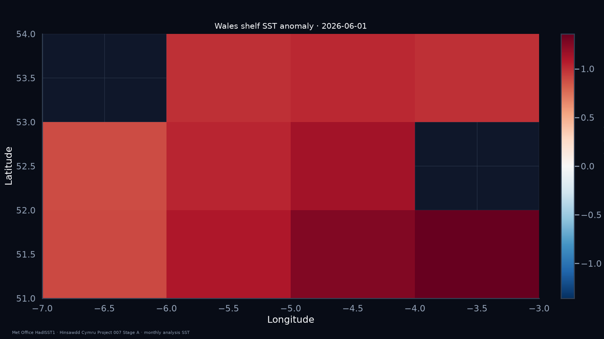
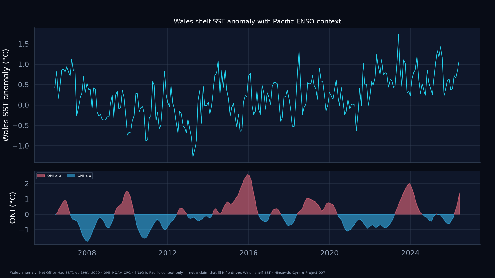

# Project 007 — Wales coastal sea-surface temperature

## Publication status

**Stage A published.** Open HadISST1 monthly Wales-shelf series, anomaly map, and ENSO context charts (dark widescreen + square).

## Question

How have sea-surface temperatures around the Welsh coast been changing against a long climatology, and what does the current shelf-sea state look like — including as a public Wales window while the Pacific ENSO cycle evolves?

Project 007 is observational. It does **not** treat El Niño as a direct cause of Welsh coastal SST. ENSO is a **global climate-context** layer only.

## What Stage A built

- Met Office **HadISST1** monthly SST subset for Wales shelf bbox `lon −6.5…−2.6`, `lat 51.2…53.6`
- Box-mean series from **1870–present** with **1991–2020** month-of-year climatology and anomaly (°C)
- NOAA **ONI** as a separate Pacific ENSO context strip
- Dark charts matching [VISUAL_STYLE.md](../../VISUAL_STYLE.md): history, latest anomaly map, ENSO context (widescreen + square PNG/SVG)
- Provenance JSON + SHA-256 for retained raw extracts under `data/raw/`

Latest headline (HadISST month **2026-06**): shelf-box SST **14.5 °C**, anomaly **+1.07 °C** vs 1991–2020; trailing 12-month mean anomaly **+0.71 °C**. Latest ONI (MJJ 2026): **+1.39** (Pacific context only).

### History (widescreen)

<a href="figures/wales_shelf_sst_history_dark.png"></a>

### Latest anomaly map

<a href="figures/wales_shelf_sst_anomaly_map_dark.png"></a>

### ENSO context

<a href="figures/wales_shelf_sst_enso_context_dark.png"></a>

## Why HadISST for Stage A

No Copernicus Marine credentials were available for ODYSSEA/OSTIA. NOAA OISST daily via ERDDAP was unreliable in this environment. **HadISST1** is public (HadOBS), long, and enough to answer the Stage A question with a reproducible Wales-shelf mean and anomaly. Higher-resolution daily products remain the follow-on once access works — see [SOURCES.md](SOURCES.md).

## Caveats

- HadISST is a **1° monthly analysis**, not a coastal thermometer or bathing-water reading.
- Coastal / land-adjacent cells are coarse; named Irish Sea / Cardigan Bay / Bristol Channel series are Stage B.
- El Niño / La Niña are Pacific phenomena; do not headline “El Niño warms Wales” from these charts.
- Not an official Met Office, Copernicus, NRW or Welsh Government product.

## Reproduce

```bash
python -m venv .venv
source .venv/bin/activate
pip install -e ".[sst,dev]"
python projects/007-wales-coastal-sst/run_stage_a.py
# or reuse retained extracts:
python projects/007-wales-coastal-sst/run_stage_a.py --skip-fetch
pytest -q projects/007-wales-coastal-sst/tests
```

Bulky full HadISST NetCDF / `.nc.gz` files are gitignored; the Wales-box monthly CSV extract and provenance JSON are retained.

## Stage plan

| Stage | Deliverable |
|---|---|
| **0** | Research brief + source shortlist |
| **A** | HadISST monthly Wales-box series + anomaly map + ONI context (current) |
| **B** | Sub-basin series; higher-res daily product when access allows |
| **C** | Documented Wales–ENSO empirical comparison (or explicit null) |
| **D** | Marine heatwave-day counting with an explicit definition |

## Docs

- [METHODOLOGY.md](METHODOLOGY.md)
- [SOURCES.md](SOURCES.md)
